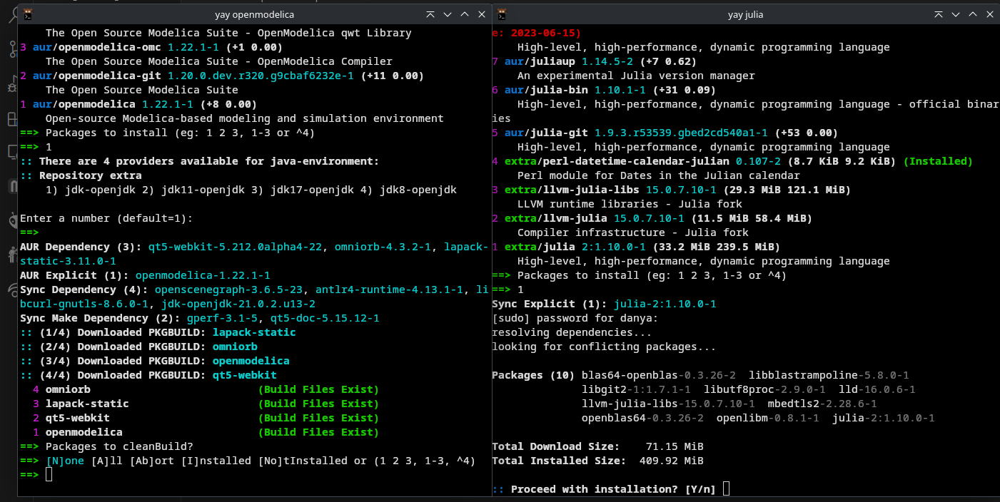
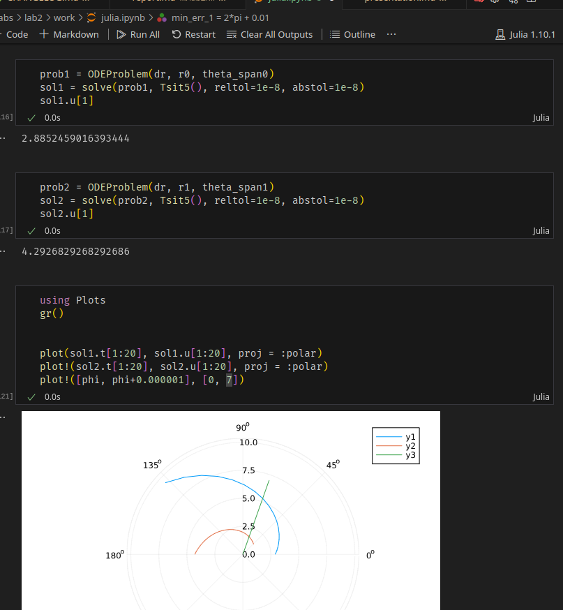
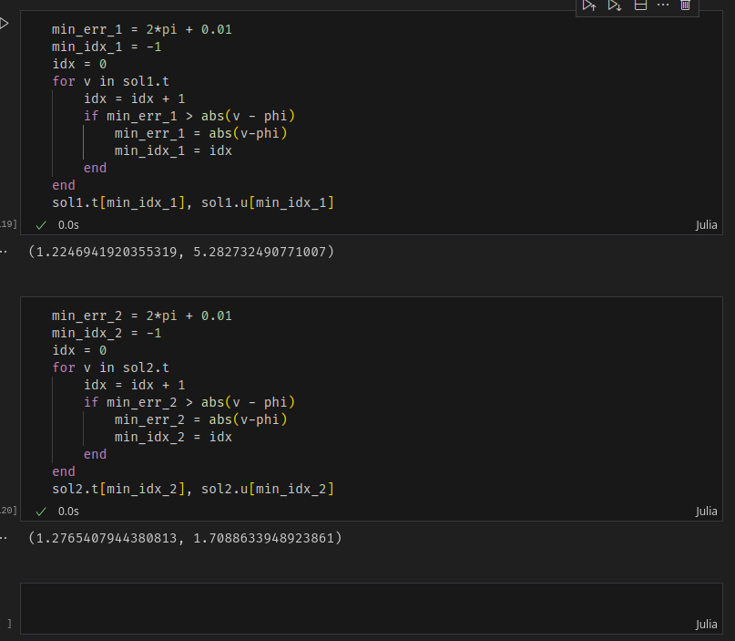
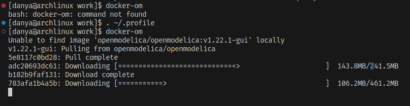
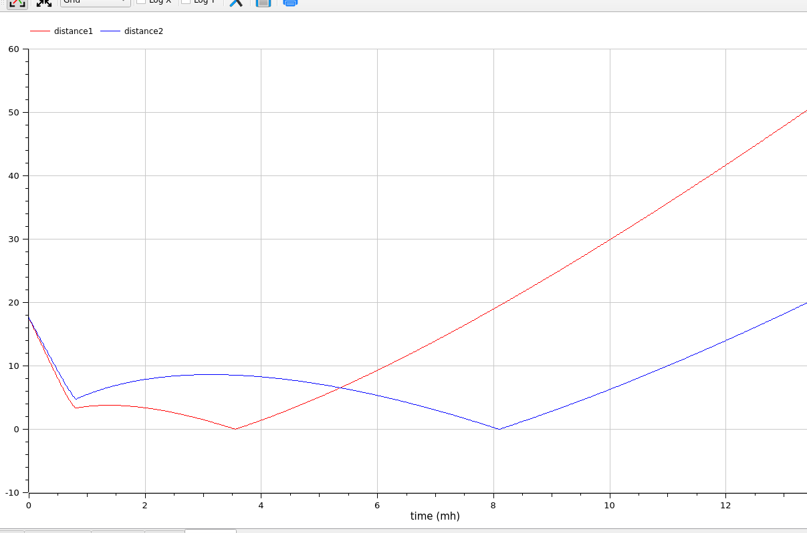

---
## Front matter
lang: ru-RU
title: Лабораторная работа 2
author:
  - Генералов Даниил, 1032212280
institute:
  - Российский университет дружбы народов, Москва, Россия
date: "2024"

## i18n babel
babel-lang: russian
babel-otherlangs: english

## Formatting pdf
toc: false
toc-title: Содержание
slide_level: 2
aspectratio: 169
section-titles: true
theme: metropolis
header-includes:
 - \metroset{progressbar=frametitle,sectionpage=progressbar,numbering=fraction}
 - '\makeatletter'
 - '\beamer@ignorenonframefalse'
 - '\makeatother'
---

# Задание

> На море в тумане катер береговой охраны преследует лодку браконьеров.
> Через определенный промежуток времени туман рассеивается, и лодка
> обнаруживается на расстоянии 17,3 км от катера. Затем лодка снова скрывается в
> тумане и уходит прямолинейно в неизвестном направлении. Известно, что скорость
> катера в 5,1 раза больше скорости браконьерской лодки.
> 1. Запишите уравнение, описывающее движение катера, с начальными
> условиями для двух случаев (в зависимости от расположения катера
> относительно лодки в начальный момент времени).
> 2. Постройте траекторию движения катера и лодки для двух случаев.
> 3. Найдите точку пересечения траектории катера и лодки

# Выполнение

## Установка

{#fig:001 width=70%}

## Вычисление: расстояние прямолинейного движения

- `x/v = (k-x) / 5.1v`: `x_1 = 10k/61`

- `x/v = (k+x) / 5.1v`: `x_2 = 10k/41`

## Вычисление: дифференциальное уравнение спирального движения

- `dr/dt = v`

- `((dtheta / dt) * r)^2 + v^2 = (5.1v)^2`; `(dtheta/dt) * r = \sqrt{41/10}v`

- Начальное условие: `theta=0, r=x1` или `theta=-pi, r=x2`.

## Julia

{#fig:002 width=70%}

## Julia

{#fig:003 width=70%}

## Julia

{#fig:004 width=70%}

## OpenModelica

{#fig:005 width=70%}

## OpenModelica

{#fig:006 width=70%}

## OpenModelica

{#fig:007 width=70%}

## OpenModelica

{#fig:008 width=70%}

## Вывод

Мы смогли реализовать решение задачи о погоне в двух языках программирования.
