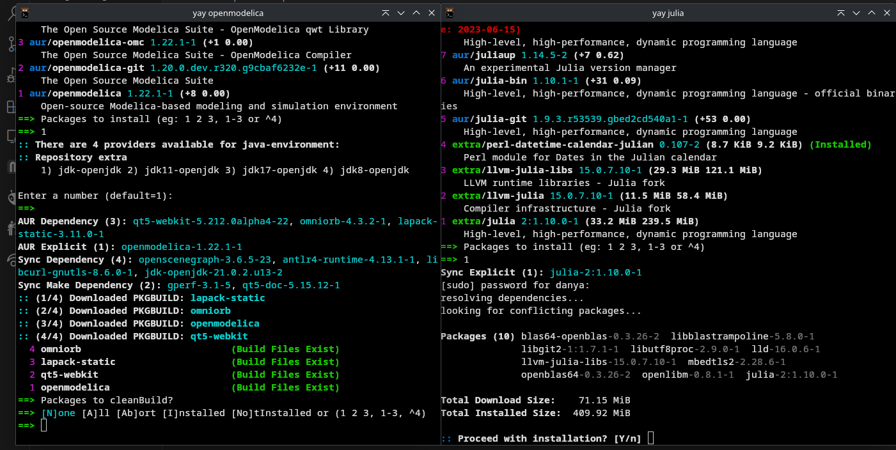
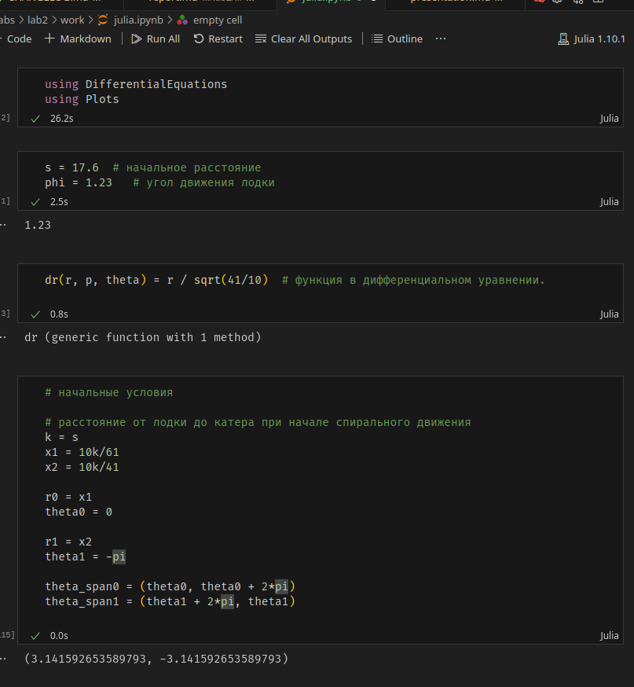
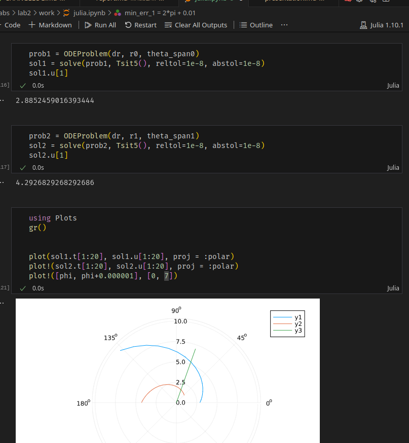
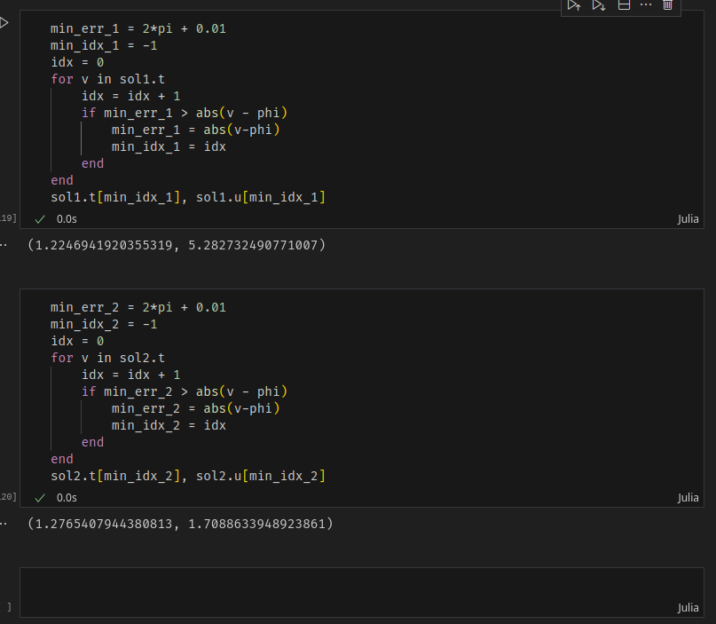
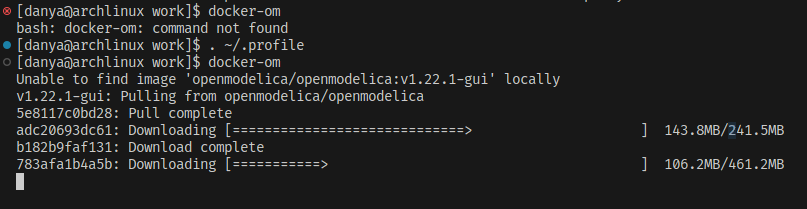
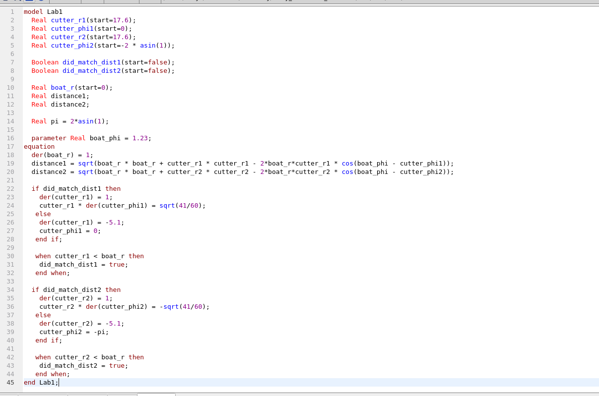
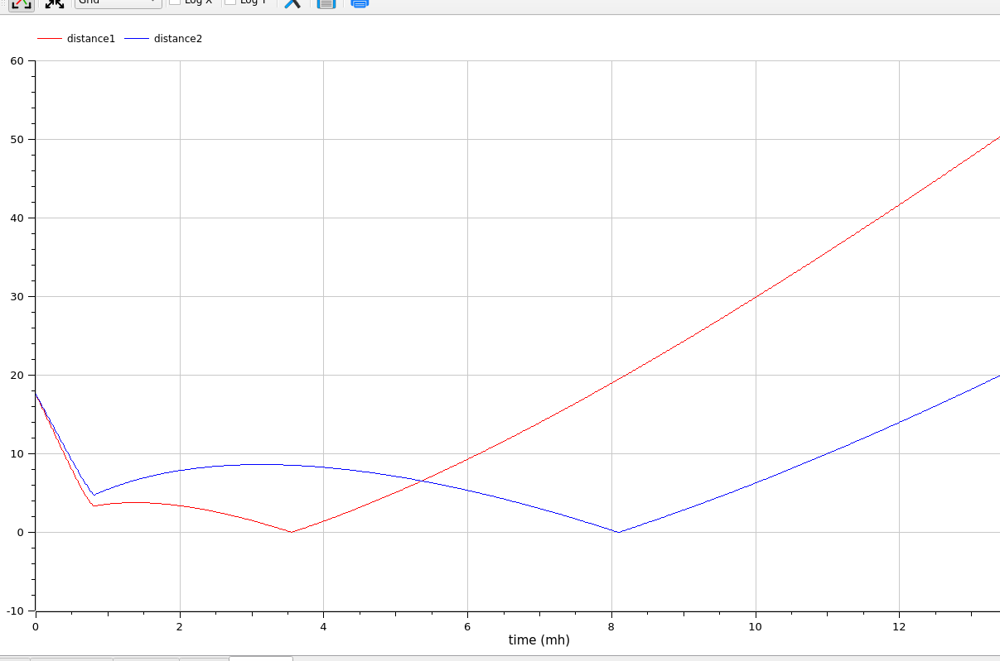
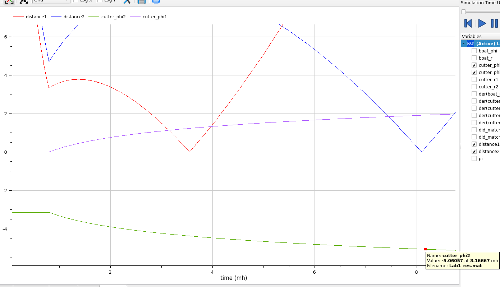

---
## Front matter
title: "Лабораторная работа 2"
author: "Генералов Даниил, 1032212280"

## Generic otions
lang: ru-RU
toc-title: "Содержание"

## Bibliography
bibliography: bib/cite.bib
csl: pandoc/csl/gost-r-7-0-5-2008-numeric.csl

## Pdf output format
toc: true # Table of contents
toc-depth: 2
lof: true # List of figures
lot: true # List of tables
fontsize: 12pt
linestretch: 1.5
papersize: a4
documentclass: scrreprt
## I18n polyglossia
polyglossia-lang:
  name: russian
  options:
	- spelling=modern
	- babelshorthands=true
polyglossia-otherlangs:
  name: english
## I18n babel
babel-lang: russian
babel-otherlangs: english
## Fonts
mainfont: PT Serif
romanfont: PT Serif
sansfont: PT Sans
monofont: PT Mono
mainfontoptions: Ligatures=TeX
romanfontoptions: Ligatures=TeX
sansfontoptions: Ligatures=TeX,Scale=MatchLowercase
monofontoptions: Scale=MatchLowercase,Scale=0.9
## Biblatex
biblatex: true
biblio-style: "gost-numeric"
biblatexoptions:
  - parentracker=true
  - backend=biber
  - hyperref=auto
  - language=auto
  - autolang=other*
  - citestyle=gost-numeric
## Pandoc-crossref LaTeX customization
figureTitle: "Рис."
tableTitle: "Таблица"
listingTitle: "Листинг"
lofTitle: "Список иллюстраций"
lotTitle: "Список таблиц"
lolTitle: "Листинги"
## Misc options
indent: true
header-includes:
  - \usepackage{indentfirst}
  - \usepackage{float} # keep figures where there are in the text
  - \floatplacement{figure}{H} # keep figures where there are in the text
---

# Цель работы

В этой лабораторной работе требуется решить задачу о погоне,
а также установить системы разработки OpenModelica и Julia.

# Задание

Мой номер билета -- 1032212280,
поэтому из 70 вариантов
мой вариант -- 51.

> На море в тумане катер береговой охраны преследует лодку браконьеров.
> Через определенный промежуток времени туман рассеивается, и лодка
> обнаруживается на расстоянии 17,3 км от катера. Затем лодка снова скрывается в
> тумане и уходит прямолинейно в неизвестном направлении. Известно, что скорость
> катера в 5,1 раза больше скорости браконьерской лодки.
> 1. Запишите уравнение, описывающее движение катера, с начальными
> условиями для двух случаев (в зависимости от расположения катера
> относительно лодки в начальный момент времени).
> 2. Постройте траекторию движения катера и лодки для двух случаев.
> 3. Найдите точку пересечения траектории катера и лодки


# Выполнение

Сначала я поставил на свой компьютер среды разработки на требуемых языках (рис. @fig:001).

{#fig:001 width=70%}

После этого мы можем начать рассмотрение задачи.
Мы используем полярные координаты, чтобы упростить подсчет.

В начальный момент обнаружения браконьерской лодки она находится в центре системы координат,
а затем начинает прямолинейно двигаться в неопределенном направлении.
Катер находился на расстоянии `17.3=k` от полюса, и мы можем сказать, что угол равен 0.

Катер должен будет сначала встать на то же самое расстояние от полюса, как и лодка,
а затем двигаться по спирали, отдаляясь от него с той же скоростью, что и лодка.


Пусть через время `t` катер и лодка окажутся на одном расстоянииx от полюса. За
это время лодка пройдет `x`, а катер `k-x` (или `k+x`, в зависимости от
начального положения катера относительно полюса).
Время, за которое они
пройдут это расстояние, вычисляется как `x/v` или `k-x/5.1v` (во втором
случае `x+k / 5.1v` ). Так как время одно и то же, то эти величины одинаковы.
Тогда неизвестное расстояниеx можно найти из следующего уравнения:

`x/v = (k-x) / 5.1v`: `x_1 = 10k/61`;
`x/v = (k+x) / 5.1v`: `x_2 = 10k/41`.


После этого, когда катер начинает двигаться по спирали, то у него есть два компонента скорости: радиальная и тангенциальная.
Радиальная должна быть равна скорости лодки: `dr/dt = v`.
Тангенциальная (произведение угловой скорости на радиус) -- остаток всей скорости катера, который перпендикулярен этому:
`((dtheta / dt) * r)^2 + v^2 = (5.1v)^2`; `(dtheta/dt) * r = \sqrt{41/10}v`.

Чтобы найти траекторию, мы решаем дифференциальные уравнения: `dr/dt = v; r*(dtheta/dt) = \sqrt{41/10}v`
с начальными условиями `theta=0, r=x1` или `theta=-pi, r=x2`.
Систему можно привести к виду `dr / dtheta = r / \sqrt{41/10}`.

Сначала мы пишем код Julia, чтобы выполнить эти вычисления.
Для начала мы устанавливаем начальные условия: катер находился на расстоянии
17.6 от лодки, а затем лодка направилась в случайном направлении (здесь -- 1.23 радиана).
Катер мог начать свое движение в направлении 0 или `pi` радианов,
поэтому мы расчитываем две начальных точки
(рис. @fig:002).

{#fig:002 width=70%}

После этого мы решаем это дифференциальное уравнение в двух случаях и выводим результаты на экран.
Видно, что в обоих случаях траектория катера пересекается с траекторией лодки за меньше половины оборота, что доказывает, что эта траектория является оптимальной
(рис. @fig:003).

{#fig:003 width=70%}

Наконец, мы определяем точку столкновения катера и лодки.
Поскольку решение дифференциального уравнения -- в форме двух списков,
мы должны найти такую точку в списке, где угол ближе всего к углу движения лодки.
В обоих случаях встреча произойдет на координате `theta=1.23` (потому что именно там находится лодка),
а в первом случае расстояние равно `r=5.2827`, а во-втором -- `r=1.7088`.
(рис. @fig:004).

{#fig:004 width=70%}

Мы смогли реализовать этот код на Julia благодаря официальной документации: [@julialang]

После этого мы реализуем этот же код в OpenModelica.
У меня возникли проблемы с установкой среды разработки этого языка, поэтому я буду использовать Docker-версию.
Можно использовать следующую команду, чтобы добавить команду `docker-om`, которая запустит GUI-версию OpenModelica через Docker:

```bash
echo $'alias docker-om=\'docker run -it --rm -v "$HOME:$HOME" -e "HOME=$HOME" -w "$PWD" -e "DISPLAY=$DISPLAY" --user $UID openmodelica/openmodelica:v1.22.1-gui\'' >> "$HOME/.profile"
```

После этого мы запускаем это, и Docker загружает нужный образ
(рис. @fig:005).

{#fig:005 width=70%}


Затем мы создаем требуемую модель в OpenModelica.
В отличии от кода в Julia, мы можем начать симуляцию
с времени начала и симулировать шаг прямолинейного движения:
пока катер не находится на том же расстоянии от центра, как и лодка,
катер едет к центру с скоростью 5.1 (принимая скорость лодки равной 1).
Когда же эти скорости совпадают, мы переключаем флаг, который включает поведение,
соответствующее выведенному дифференциальному уравнению.
Код параллельно симулирует оба варианта: когда катер находится по углу 0 и `pi`
(рис. @fig:006).

{#fig:006 width=70%}

Используя выведенную переменную `distance`, мы можем определить, что катер сталкивается с лодкой в обоих случаях:
эта переменная достигает нуля
(рис. @fig:007).

{#fig:007 width=70%}

Столкновение происходит в правильном месте:
в первом случае ровно на 1.23 радианах,
а во втором -- на этом углу минус 2pi,
что тот же самый угол
(рис. @fig:008).

{#fig:008 width=70%}

Мы смогли реализовать этот код на OpenModelica благодаря документации: [@modelica]


# Выводы

Мы смогли реализовать решение задачи о погоне в двух языках программирования.

# Список литературы{.unnumbered}

::: {#refs}
:::
