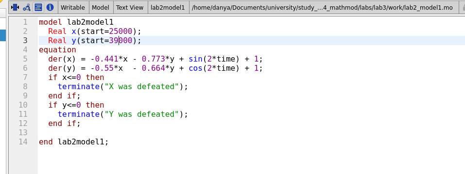
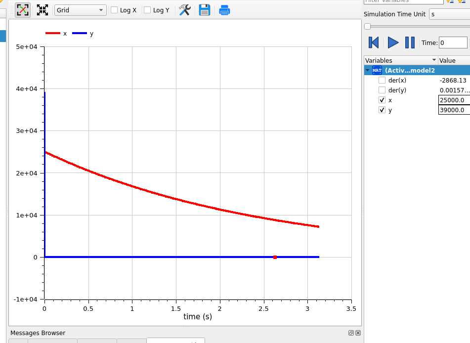
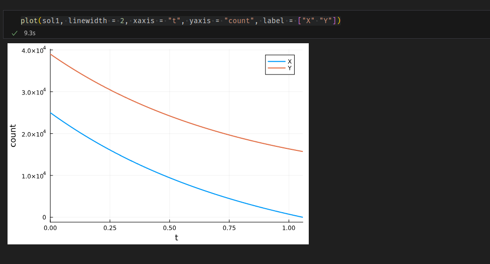
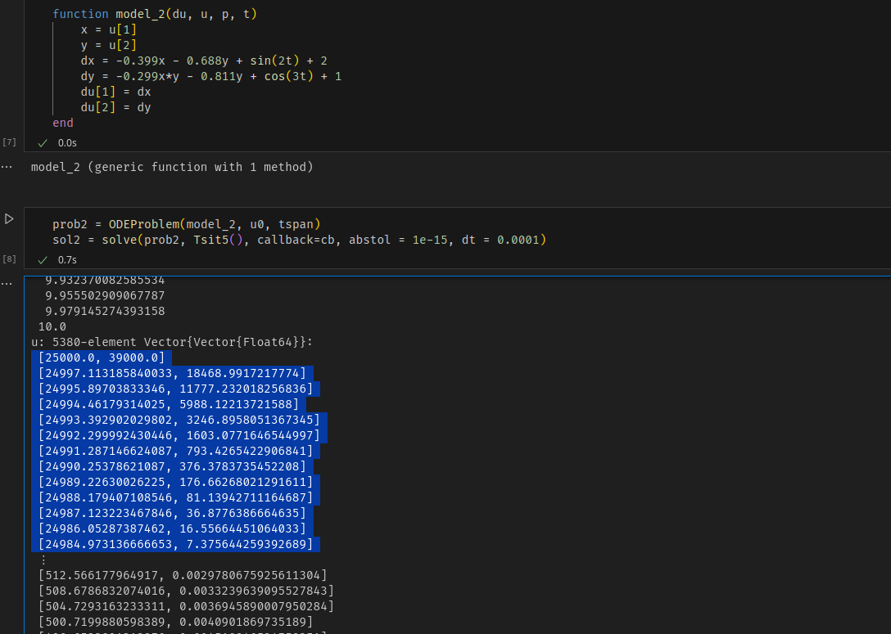

---
## Front matter
lang: ru-RU
title: Лабораторная работа 3
author:
  - Генералов Даниил 1032212280
institute:
  - Российский университет дружбы народов, Москва, Россия
date: 2024

## i18n babel
babel-lang: russian
babel-otherlangs: english

## Formatting pdf
toc: false
toc-title: Содержание
slide_level: 2
aspectratio: 169
section-titles: true
theme: metropolis
header-includes:
 - \metroset{progressbar=frametitle,sectionpage=progressbar,numbering=fraction}
 - '\makeatletter'
 - '\beamer@ignorenonframefalse'
 - '\makeatother'
---

## Задача

> Между страной Х и страной У идет война. Численность состава войск
> исчисляется от начала войны, и являются временными функциями x(t) и y(t). В
> начальный момент времени страна Х имеет армию численностью 25 000 человек, а
> в распоряжении страны У армия численностью в 39 000 человек. Для упрощения
> модели считаем, что коэффициенты a, b, c, h постоянны. Также считаем P(t) и Q(t)
> непрерывные функции.

## Задача

1. Модель боевых действий между регулярными войсками

$$\frac{dx}{dt} = -0.441x(t) - 0.773y(t) + sin(2t) + 1$$

$$\frac{dy}{dt} = -0.55x(t) - 0.664y(t) + cos(2t) + 1$$

## Задача

2. Модель ведение боевых действий с участием регулярных войск и
партизанских отрядов

$$\frac{dx}{dt} = -0.399x(t) - 0.688y(t) + sin(2t) + 2$$

$$\frac{dy}{dt} = -0.299x(t)y(t) - 0.811y(t) + cos(3t) + 1$$

## Выполнение: OpenModelica

{#fig:001 width=70%}

## Выполнение: OpenModelica
{#fig:002 width=70%}

## Выполнение: OpenModelica
{#fig:003 width=70%}

## Выполнение: OpenModelica
{#fig:004 width=70%}

## Выполнение: OpenModelica
{#fig:005 width=70%}

## Выполнение: Julia
{#fig:006 width=70%}

## Выполнение: Julia
{#fig:007 width=70%}

## Выполнение: Julia
{#fig:008 width=70%}

## Выполнение: Julia
{#fig:009 width=70%}

## Выполнение: Julia
{#fig:010 width=70%}

## Вывод

> Мы использовали языки программирования для решения задачи о боевых действиях с помощью обыкновенных дифференциальных уравнений.
