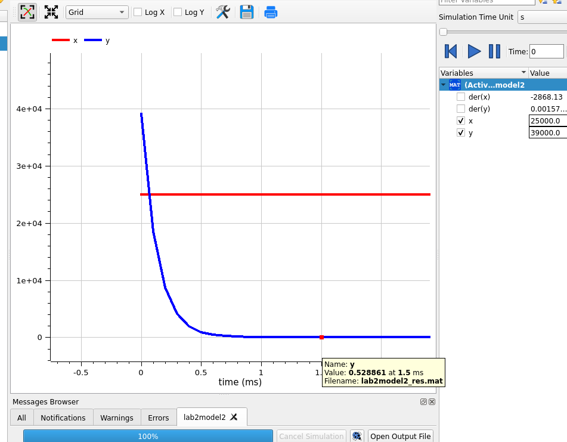

---
## Front matter
title: "Лабораторная работа 3"
author: "Генералов Даниил 1032212280"

## Generic otions
lang: ru-RU
toc-title: "Содержание"

## Bibliography
bibliography: bib/cite.bib
csl: pandoc/csl/gost-r-7-0-5-2008-numeric.csl

## Pdf output format
toc: true # Table of contents
toc-depth: 2
lof: true # List of figures
lot: true # List of tables
fontsize: 12pt
linestretch: 1.5
papersize: a4
documentclass: scrreprt
## I18n polyglossia
polyglossia-lang:
  name: russian
  options:
	- spelling=modern
	- babelshorthands=true
polyglossia-otherlangs:
  name: english
## I18n babel
babel-lang: russian
babel-otherlangs: english
## Fonts
mainfont: PT Serif
romanfont: PT Serif
sansfont: PT Sans
monofont: PT Mono
mainfontoptions: Ligatures=TeX
romanfontoptions: Ligatures=TeX
sansfontoptions: Ligatures=TeX,Scale=MatchLowercase
monofontoptions: Scale=MatchLowercase,Scale=0.9
## Biblatex
biblatex: true
biblio-style: "gost-numeric"
biblatexoptions:
  - parentracker=true
  - backend=biber
  - hyperref=auto
  - language=auto
  - autolang=other*
  - citestyle=gost-numeric
## Pandoc-crossref LaTeX customization
figureTitle: "Рис."
tableTitle: "Таблица"
listingTitle: "Листинг"
lofTitle: "Список иллюстраций"
lotTitle: "Список таблиц"
lolTitle: "Листинги"
## Misc options
indent: true
header-includes:
  - \usepackage{indentfirst}
  - \usepackage{float} # keep figures where there are in the text
  - \floatplacement{figure}{H} # keep figures where there are in the text
---

# Цель работы

Цель лабораторной работы -- использование модели боевых действий для решения численностей армии.

# Задание

Мой номер студенческого билета 1032212280, и всего вариантов 70, поэтому у меня вариант 51:

> Между страной Х и страной У идет война. Численность состава войск
> исчисляется от начала войны, и являются временными функциями x(t) и y(t). В
> начальный момент времени страна Х имеет армию численностью 25 000 человек, а
> в распоряжении страны У армия численностью в 39 000 человек. Для упрощения
> модели считаем, что коэффициенты a, b, c, h постоянны. Также считаем P(t) и Q(t)
> непрерывные функции.
>
> Постройте графики изменения численности войск армии Х и армии У для
> следующих случаев:
> 1. Модель боевых действий между регулярными войсками
> `dx/dt = -0.441x(t) - 0.773y(t) + sin(2t) + 1`;
> `dy/dt = -0.55x(t) - 0.664y(t) + cos(2t) + 1`
> 2. Модель ведение боевых действий с участием регулярных войск и
> партизанских отрядов
> `dx/dt = -0.399x(t) - 0.688y(t) + sin(2t) + 2`;
> `dy/dt = -0.299x(t)y(t) - 0.811y(t) + cos(3t) + 1`

# Выполнение лабораторной работы

В этой работе требуется найти решения двух систем дифференциальных уравнений, которые даны в задании.
Сначала мы можем записать их в OpenModelica, потому что этот язык ближе описывает дифференциальные уравнения в исходном формате.

Сначала мы задаем первую систему уравнений, с участием только регулярных войск на рис. @fig:001.

{#fig:001 width=70%}

При запуске модели мы видим,
что армия X истощается быстрее чем армия Y,
и война заканчивается через 1.06 секунд,
когда у Y остается еще 15696.1 войск (график на рис. @fig:002 заканчивается в тот момент, когда один из X и Y достигает нуля).

{#fig:002 width=70%}

После этого мы записываем вторую модель,
которая сложнее первой,
потому что скорость изменения Y теперь зависит от численности Y, а не только от численности X:
на рис. @fig:003 строчка 6 сложнее чем строчка 5.

{#fig:003 width=70%}

Результат вычисления этой модели радикально отличается от результата первой модели:
из-за того, что скорость изменения Y зависит от X*Y, то есть почти что квадрата численности армий,
то значение Y очень быстро уходит почти до нуля,
а затем остается там долгое время, потому что скорость угасания теперь очень сильно ограничена тем, что скорость потерь теперь умножается на близкое к нулю значение.
На рис. @fig:004 график числености Y выглядит как вертикальная прямая в начале и горизонтальная потом.

{#fig:004 width=70%}

Рис. @fig:005 показывает, что численность армии Y уже становится меньше единицы по истечении 1.5мс, где одна единица времени равна одной секунде;
если бы одна единица времени равнялась одному году, то этот интервал времени слегка выше 13 часов. Вторая модель должна соответствовать ведению военных действий с партизанами;
такой результат подсказывает, что партизаны обладают ядерным оружием.

{#fig:005 width=70%}

Мы смогли реализовать этот код на OpenModelica благодаря документации: [@modelica]

После этого мы можем реализовать эти системы уравнений на Julia.
Сначала мы задаем первую модель, а также начальные условия: на рис. @fig:006 функция `model_1` меняет значение аргумента `du`, чтобы оно было равно текущему значению производных.

{#fig:006 width=70%}

Как и в OpenModelica, мы хотим остановить симуляцию, когда одна из армий исчерпается.
Для этого мы создаем два `ContinuousCallback`, которые выполнят действие `terminate!` с интегратором,
когда значения `u[1]` и `u[2]` (численность X и Y соответственно)
станут равны нулю.
Они затем упаковываются в `CallbackSet`, который используется при вычислении.
На рис. @fig:007 видно, что наш ответ совпадает с ответом OpenModelica: война заканчивается через 1.05 единиц времени,
и численность войск Y к этому моменту времени составляет 15711.79.

{#fig:007 width=70%}

График на рис. @fig:008 также похож на уже полученный.

{#fig:008 width=70%}

После этого мы определяем вторую модель и считаем ее.
На рис. @fig:009 мы видим, что первые пункты данных в вычислении показывают очень быстрое падение численности Y.
Поскольку решатель дифференциальных уравнений `Tsit5` динамически меняет шаг времени между двумя соседними точками,
это падение происходит чрезвычайно быстро: значение Y доходит до 7.37 за 0.00114 секунды, или чуть больше 10 часов.

{#fig:009 width=70%}

На графике это видно, также как и в OpenModelica, как почти вертикальная прямая.
Из-за особенностей используемых решателей, здесь значение Y не становится ниже нуля за исследуемый интервал времени,
и поэтому все 10 секунд симуляции показываются на рис. @fig:010.

{#fig:010 width=70%}

Мы смогли реализовать этот код на Julia благодаря официальной документации: [@julialang]

# Выводы

Мы использовали языки программирования для решения задачи о боевых действиях с помощью обыкновенных дифференциальных уравнений.

# Список литературы{.unnumbered}

::: {#refs}
:::
