---
## Front matter
lang: ru-RU
title: Лабораторная работа 4
author:
  - Генералов Даниил 1032212280
institute:
  - Российский университет дружбы народов, Москва, Россия
date: 2024

## i18n babel
babel-lang: russian
babel-otherlangs: english

## Formatting pdf
toc: false
toc-title: Содержание
slide_level: 2
aspectratio: 169
section-titles: true
theme: metropolis
header-includes:
 - \metroset{progressbar=frametitle,sectionpage=progressbar,numbering=fraction}
 - '\makeatletter'
 - '\beamer@ignorenonframefalse'
 - '\makeatother'
---

## Задача

> Постройте фазовый портрет гармонического осциллятора и решение уравнения
гармонического осциллятора для следующих случаев
> 1. Колебания гармонического осциллятора без затуханий и без действий внешней силы x'' + 1.7x = 0
> 2. Колебания гармонического осциллятора c затуханием и без действий внешней силы: x'' + 1.7x' + 1.7x = 0
> 3. Колебания гармонического осциллятора c затуханием и под действием внешней силы: x'' + 2x' + 1.7x = 0.7cos(2.7t)
> На интервале t `\in` [0; 59] (шаг 0.05) с начальными условиями x_0=1.7, y_0=-0.2

## Выполнение: Julia

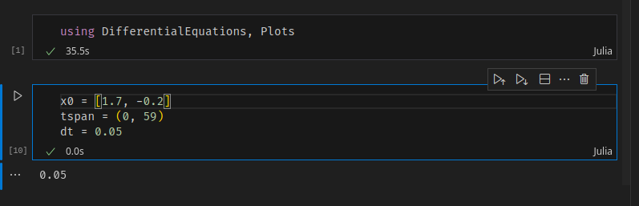{#fig:001 width=70%}

## Выполнение: Julia
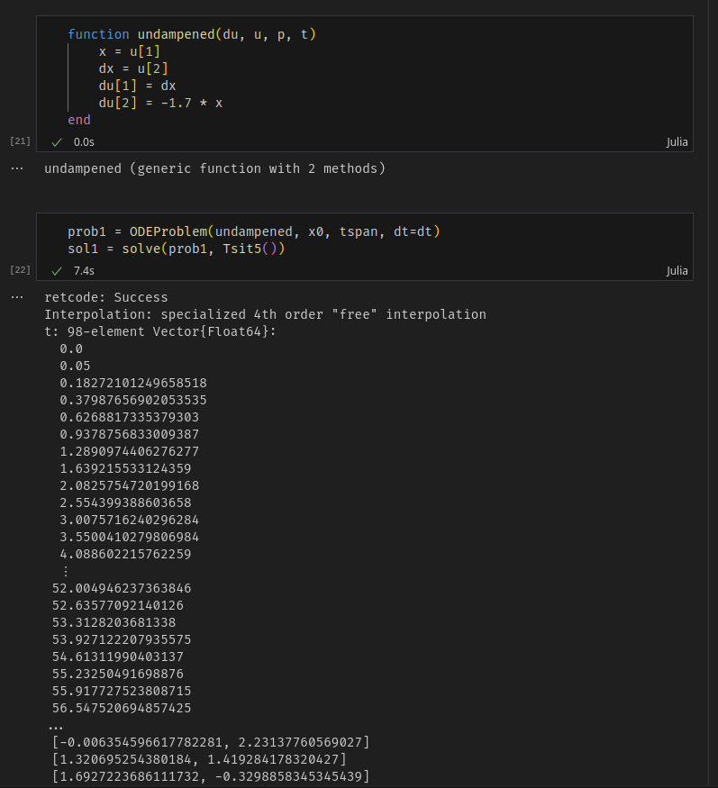{#fig:002 width=70%}

## Выполнение: Julia
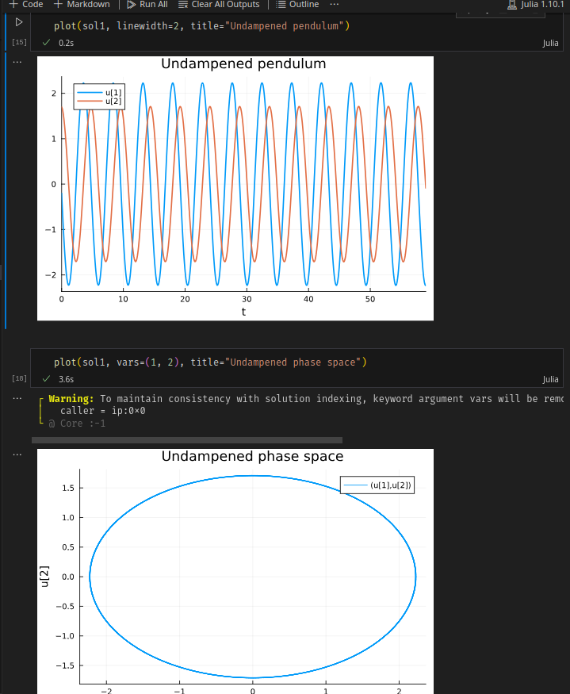{#fig:003 width=70%}

## Выполнение: Julia
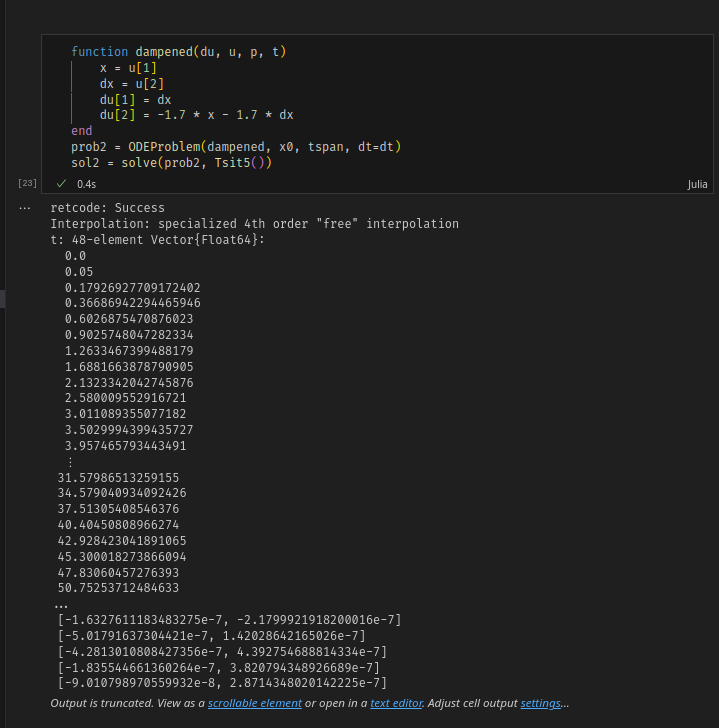{#fig:004 width=70%}

## Выполнение: Julia
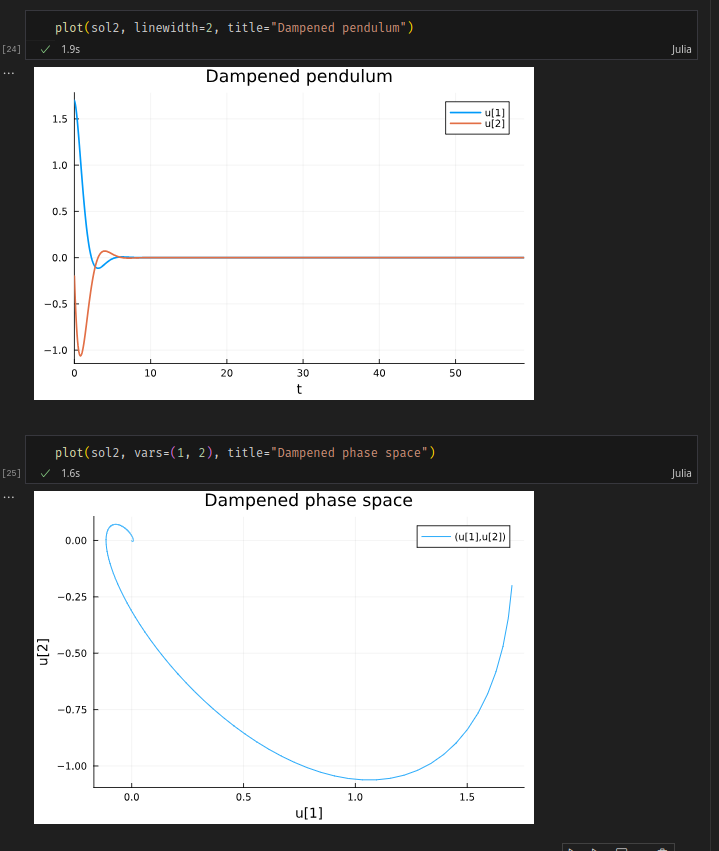{#fig:005 width=70%}

## Выполнение: Julia
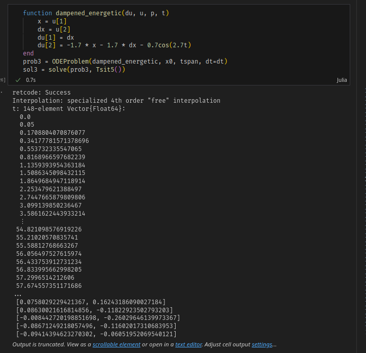{#fig:006 width=70%}

## Выполнение: Julia
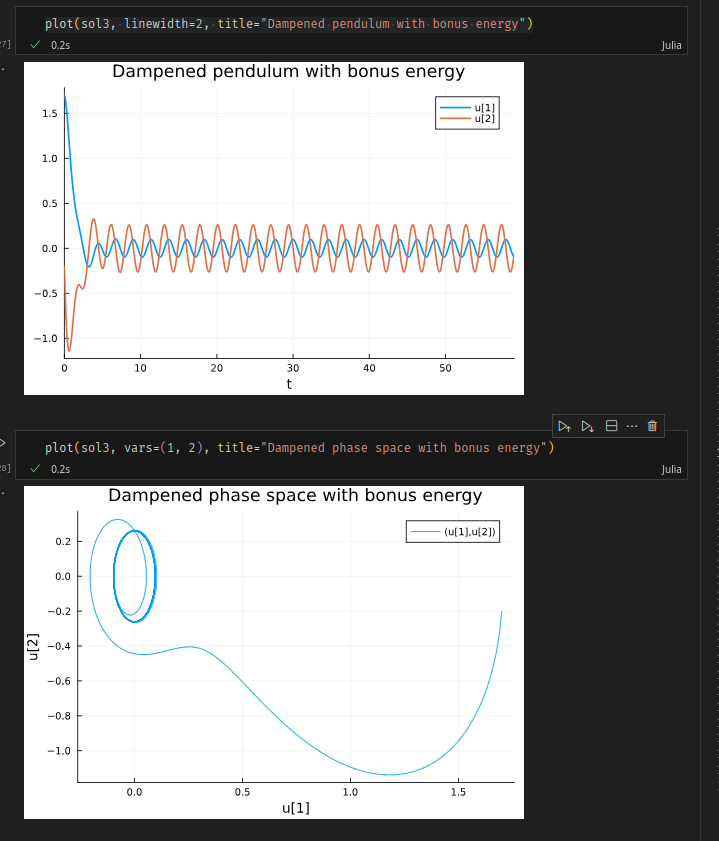{#fig:007 width=70%}

## Выполнение: OpenModelica
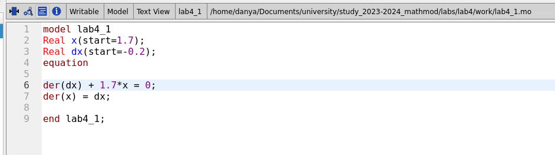{#fig:008 width=70%}

## Выполнение: OpenModelica
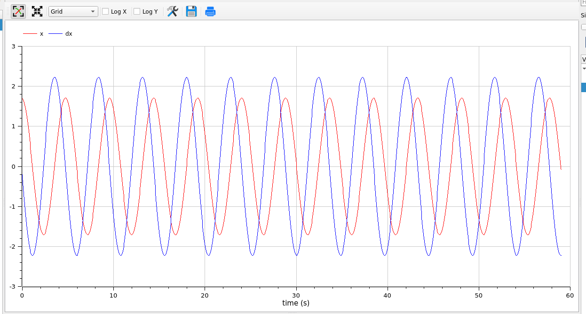{#fig:009 width=70%}

## Выполнение: OpenModelica
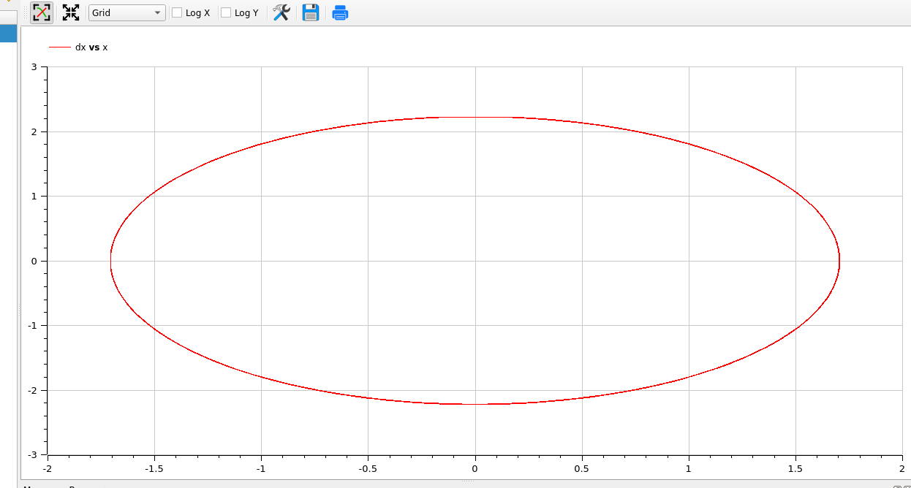{#fig:010 width=70%}

## Выполнение: OpenModelica
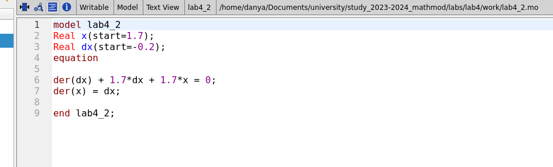{#fig:011 width=70%}

## Выполнение: OpenModelica
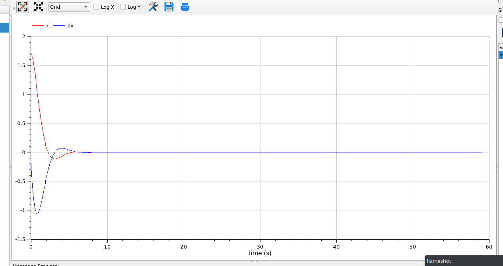{#fig:012 width=70%}

## Выполнение: OpenModelica
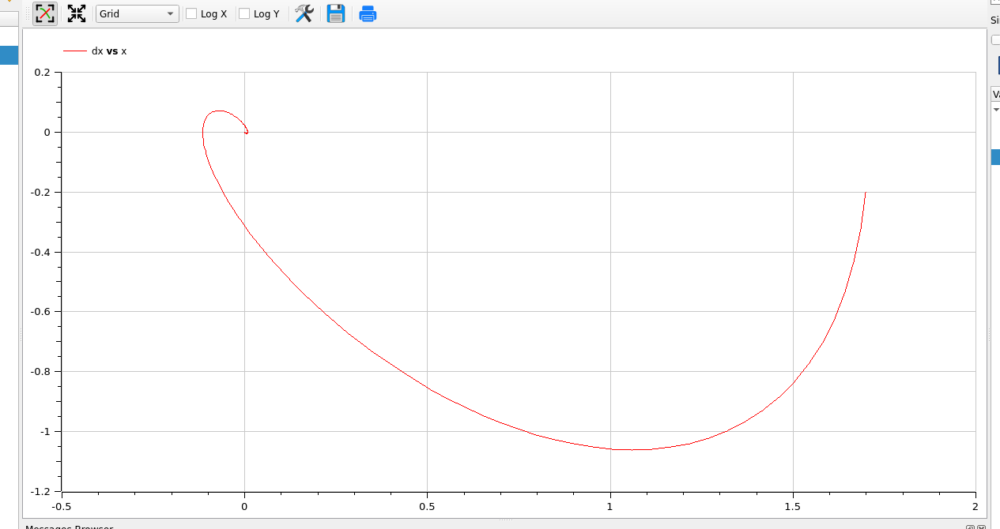{#fig:013 width=70%}

## Выполнение: OpenModelica
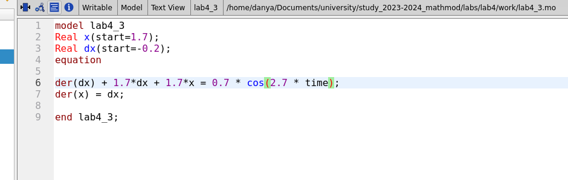{#fig:014 width=70%}

## Выполнение: OpenModelica
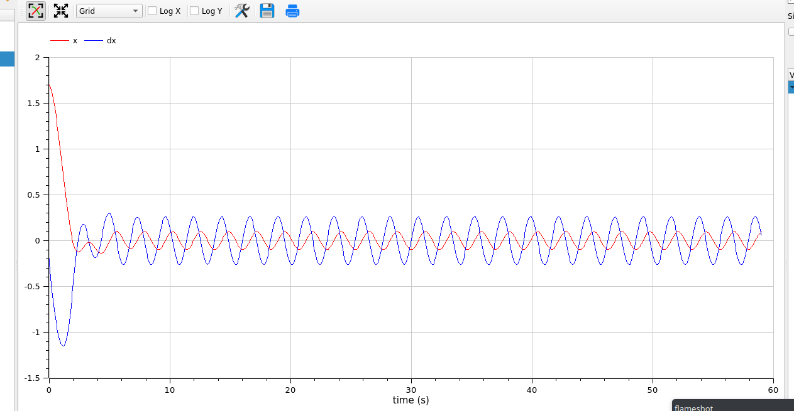{#fig:015 width=70%}

## Выполнение: OpenModelica
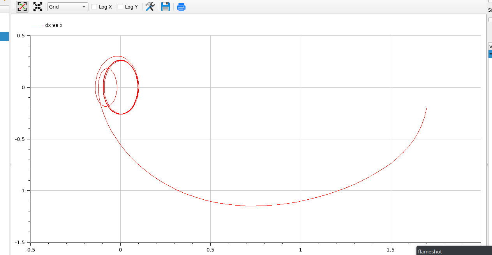{#fig:016 width=70%}

## Вывод

> Мы смогли успешно симулировать поведение маятника без затухания, с ним и с дополнительной энергией.
