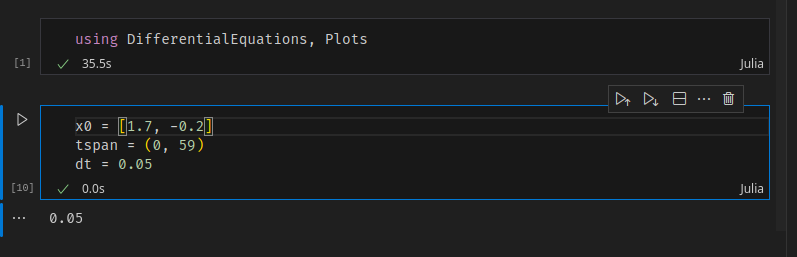
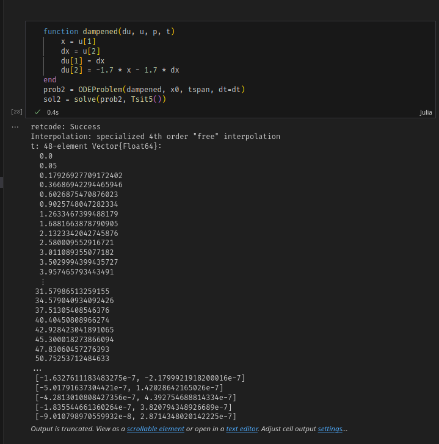
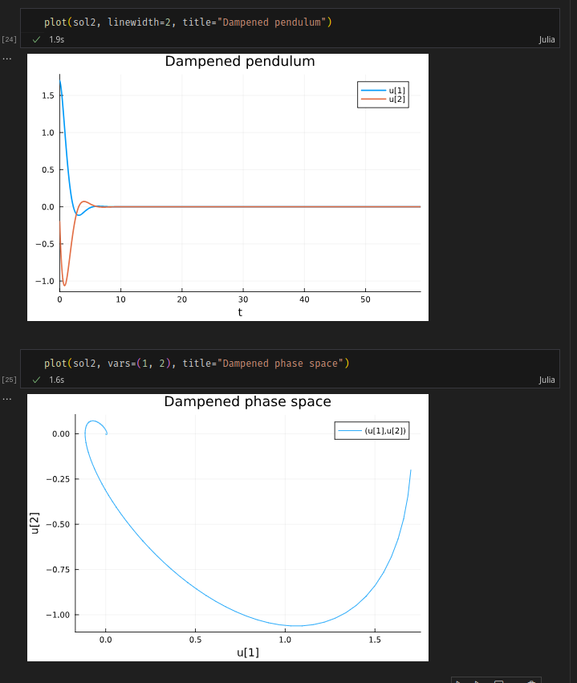
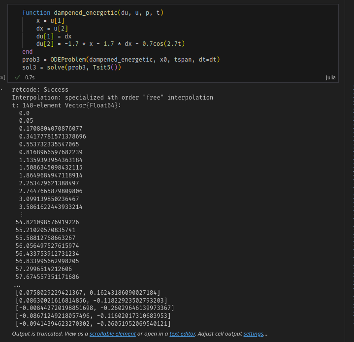
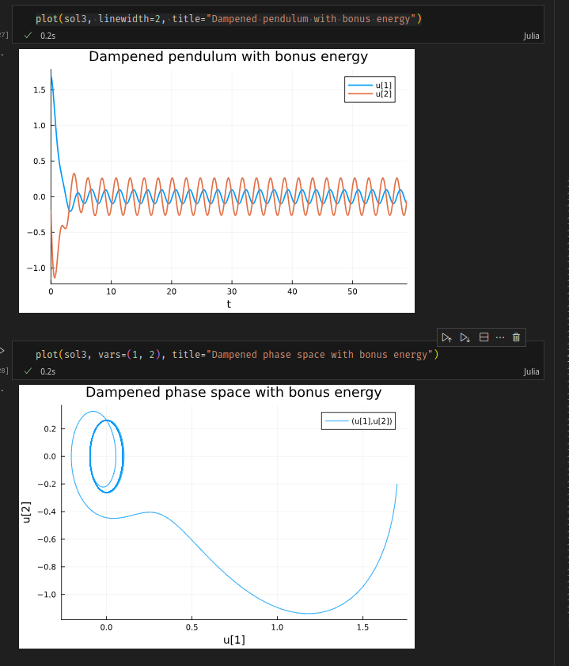
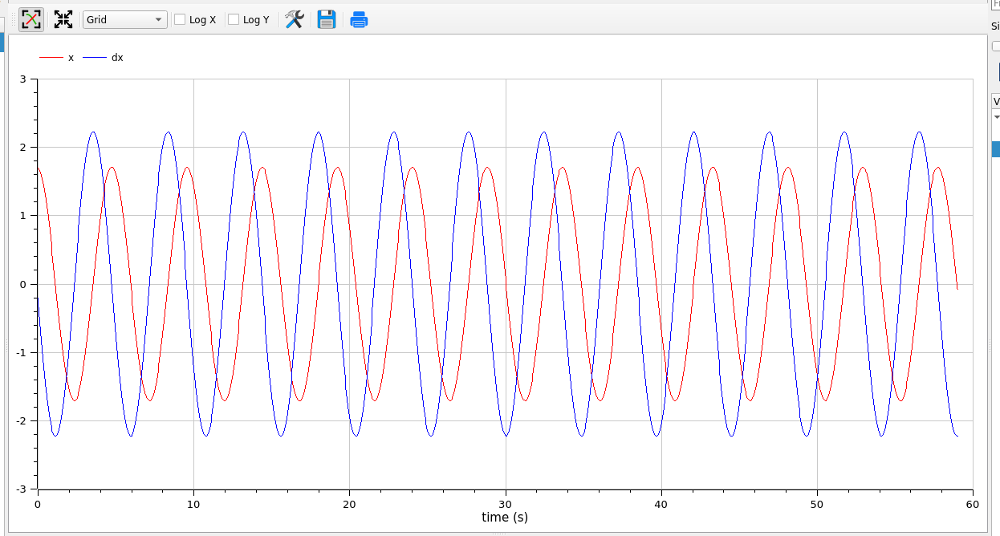
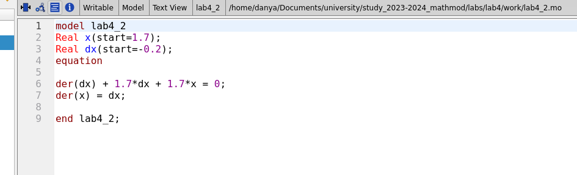
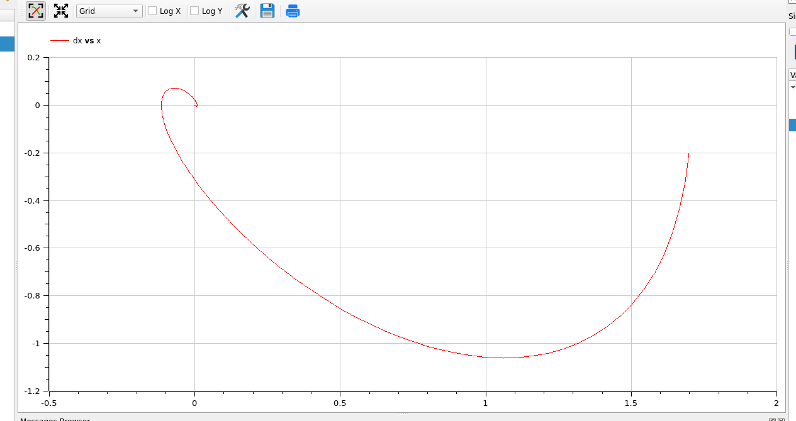
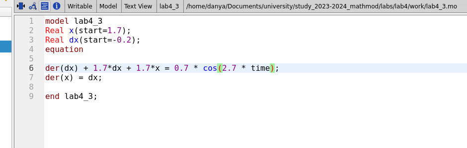
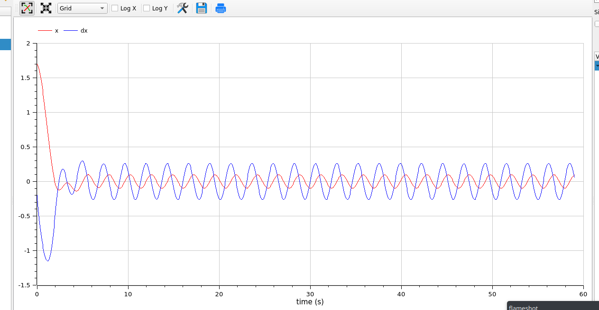

---
## Front matter
title: "Лабораторная работа 4"
author: "Генералов Даниил 1032212280"

## Generic otions
lang: ru-RU
toc-title: "Содержание"

## Bibliography
bibliography: bib/cite.bib
csl: pandoc/csl/gost-r-7-0-5-2008-numeric.csl

## Pdf output format
toc: true # Table of contents
toc-depth: 2
lof: true # List of figures
lot: true # List of tables
fontsize: 12pt
linestretch: 1.5
papersize: a4
documentclass: scrreprt
## I18n polyglossia
polyglossia-lang:
  name: russian
  options:
	- spelling=modern
	- babelshorthands=true
polyglossia-otherlangs:
  name: english
## I18n babel
babel-lang: russian
babel-otherlangs: english
## Fonts
mainfont: PT Serif
romanfont: PT Serif
sansfont: PT Sans
monofont: PT Mono
mainfontoptions: Ligatures=TeX
romanfontoptions: Ligatures=TeX
sansfontoptions: Ligatures=TeX,Scale=MatchLowercase
monofontoptions: Scale=MatchLowercase,Scale=0.9
## Biblatex
biblatex: true
biblio-style: "gost-numeric"
biblatexoptions:
  - parentracker=true
  - backend=biber
  - hyperref=auto
  - language=auto
  - autolang=other*
  - citestyle=gost-numeric
## Pandoc-crossref LaTeX customization
figureTitle: "Рис."
tableTitle: "Таблица"
listingTitle: "Листинг"
lofTitle: "Список иллюстраций"
lotTitle: "Список таблиц"
lolTitle: "Листинги"
## Misc options
indent: true
header-includes:
  - \usepackage{indentfirst}
  - \usepackage{float} # keep figures where there are in the text
  - \floatplacement{figure}{H} # keep figures where there are in the text
---

# Цель работы

Цель лабораторной работы -- моделирование нескольких моделей осцилляторов.

# Задание

Мой номер студенческого билета 1032212280, и всего вариантов 70, поэтому у меня вариант 51:

> Постройте фазовый портрет гармонического осциллятора и решение уравнения
гармонического осциллятора для следующих случаев
> 1. Колебания гармонического осциллятора без затуханий и без действий внешней силы x'' + 1.7x = 0
> 2. Колебания гармонического осциллятора c затуханием и без действий внешней силы: x'' + 1.7x' + 1.7x = 0
> 3. Колебания гармонического осциллятора c затуханием и под действием внешней силы: x'' + 2x' + 1.7x = 0.7cos(2.7t)
> На интервале t `\in` [0; 59] (шаг 0.05) с начальными условиями x_0=1.7, y_0=-0.2

# Выполнение лабораторной работы

Сначала мы реализуем эти уравнения на Julia.
Как обычно, мы подключаем 
модуль для дифференциальных уравнений и наши начальные условия (рис. @fig:001)

{#fig:001 width=70%}

После этого мы задаем нашу задачу. Поскольку это задача с дифференциальным уравнением второго порядка, мы должны преобразовать это в систему из двух уравнений первого порядка:
производная одной переменной является значением другой переменной,
и тогда значение первой переменной равно второй производной искомой функции (рис. @fig:002).

{#fig:002 width=70%}

После решения можно визуализировать это в виде графика переменной и ее производной, а также в виде фазовой диаграмы (рис. @fig:003)

{#fig:003 width=70%}

Точно так же мы решаем задачу с затухающим маятником: нужно просто поменять формулу в решении (рис. @fig:004).

{#fig:004 width=70%}

График и фазовая диаграмма также показывают, что маятник быстро стабилизируется (рис @fig:005).

{#fig:005 width=70%}

Наконец, то же самое работает для затухающего маятника с дополнительной энергией (рис. @fig:006).

{#fig:006 width=70%}

График показывает, что стабильным состоянием такой системы является состояние незатухающего маятника, которое в фазовой диаграме выглядит как окружность (рис. @fig:007)

{#fig:007 width=70%}

Мы смогли реализовать этот код на Julia благодаря официальной документации: [@julialang]

После этого мы начинаем реализацию этих моделей в OpenModelica.
Это проще, чем в Julia, но здесь тоже приходится выполнять разделение переменных,
потому что мы должны задать начальное значение первой производной (рис. @fig:008).

{#fig:008 width=70%}

Диаграмы здесь совпадают с соответствующими в Julia (рис. @fig:009 и @fig:010).

{#fig:009 width=70%}

{#fig:010 width=70%}

Затухающий график сделать настолько же просто: надо лишь добавить один термин к уравнению (рис. @fig:011).

{#fig:011 width=70%}

Диаграмы также совпадают с соответствующими в Julia (рис. @fig:012 и @fig:013).

{#fig:012 width=70%}

{#fig:013 width=70%}

Затухающий график с энергией тоже довольно простой: даже проще чем в Julia, потому что в формуле сохраняется требуемый знак (рис. @fig:014).

{#fig:014 width=70%}

Эти диаграмы также совпадают с соответствующими в Julia (рис. @fig:015 и @fig:016).

{#fig:015 width=70%}

{#fig:016 width=70%}

Мы смогли реализовать этот код на OpenModelica благодаря документации: [@modelica]

# Выводы

Мы смогли успешно симулировать поведение маятника без затухания, с ним и с дополнительной энергией.

# Список литературы{.unnumbered}

::: {#refs}
:::
