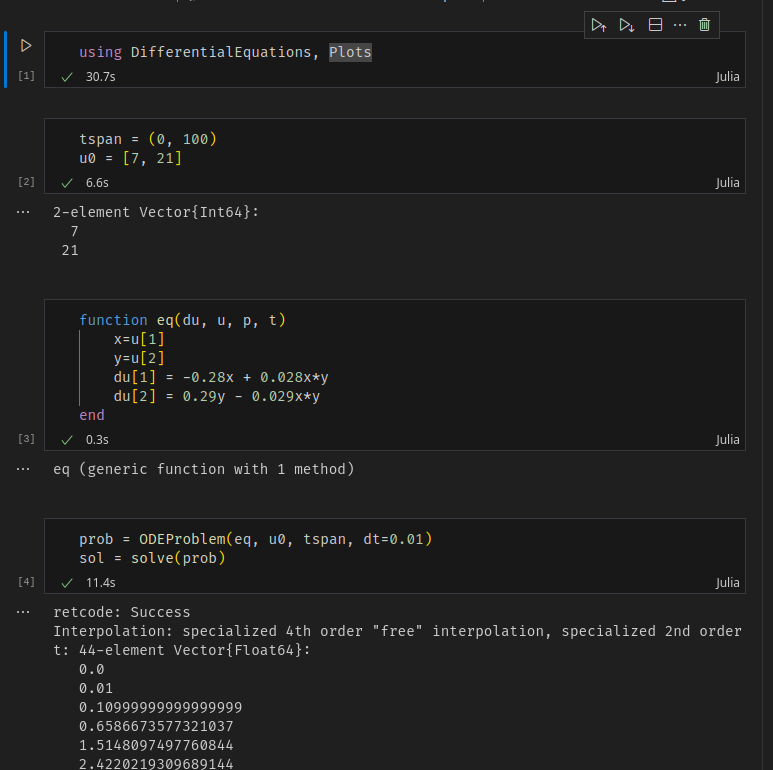
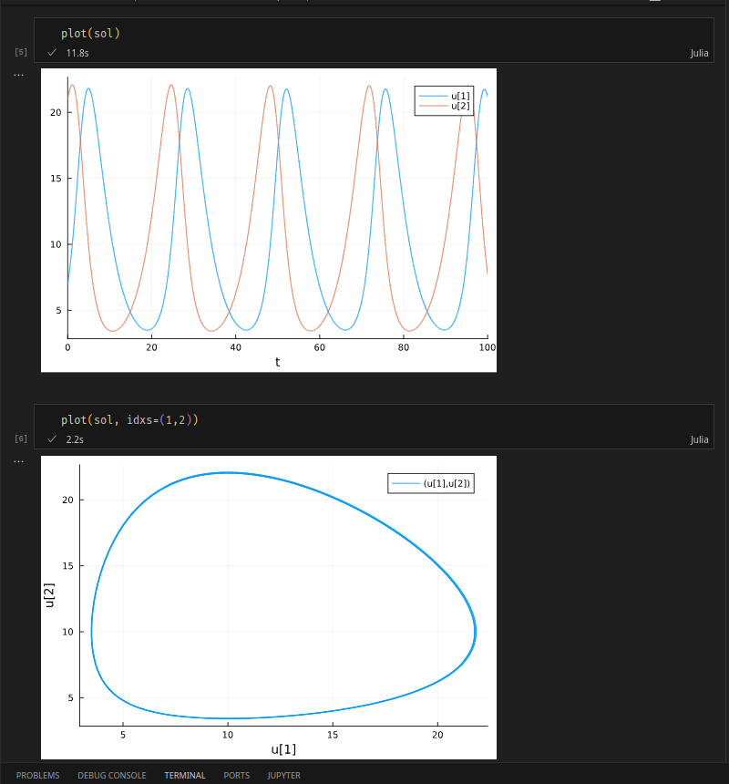
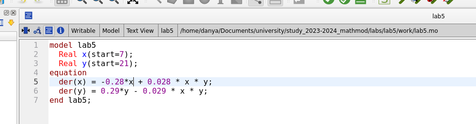
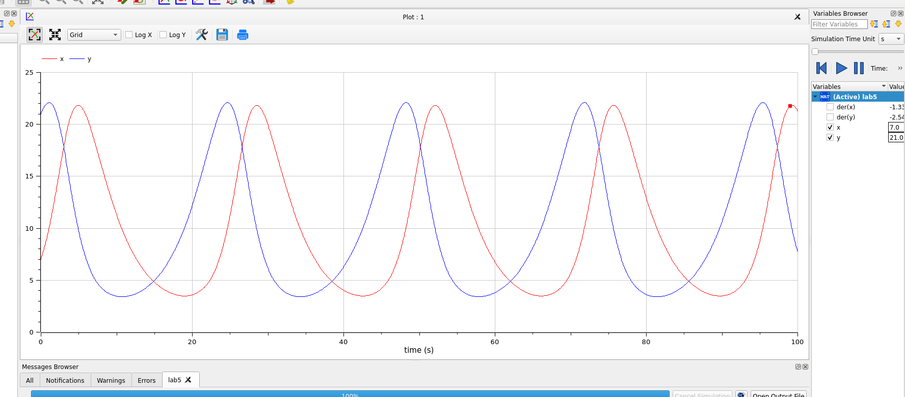
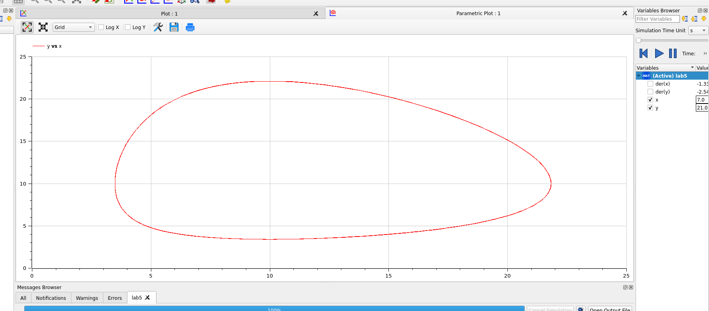
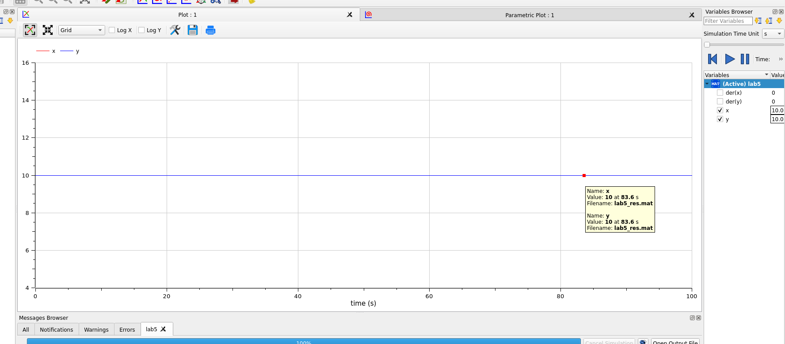

---
## Front matter
lang: ru-RU
title: Лабораторная работа 5
author:
  - Генералов Даниил, 1032212280
institute:
  - Российский университет дружбы народов, Москва, Россия
date: 2024

## i18n babel
babel-lang: russian
babel-otherlangs: english

## Formatting pdf
toc: false
toc-title: Содержание
slide_level: 2
aspectratio: 169
section-titles: true
theme: metropolis
header-includes:
 - \metroset{progressbar=frametitle,sectionpage=progressbar,numbering=fraction}
 - '\makeatletter'
 - '\beamer@ignorenonframefalse'
 - '\makeatother'
---

## Задача

> Для модели «хищник-жертва»:
> 
> dx/dt = -0.28x(t)+0.028x(t)y(t); 
> dy/dt = 0.29y(t)-0.029x(t)y(t)
>
>
>Постройте график зависимости численности хищников от численности жертв,
> а также графики изменения численности хищников и численности жертв при
> следующих начальных условиях: x0=7, y0=21. Найдите стационарное
состояние системы.

## Выполнение: Julia
{#fig:001 width=70%}

## Выполнение: Julia
{#fig:002 width=70%}

## Выполнение: OpenModelica

{#fig:003 width=70%}

## Выполнение: OpenModelica

{#fig:004 width=70%}

## Выполнение: OpenModelica

{#fig:005 width=70%}

## Стационарная точка

{#fig:006 width=70%}

## Выводы

Мы смогли получить одинаковые ответы на задачу в OpenModelica и Julia.
