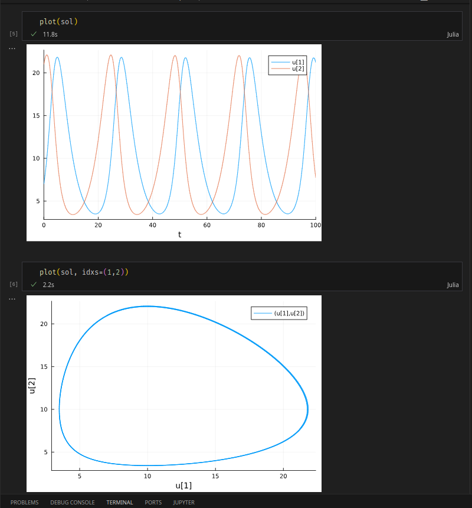
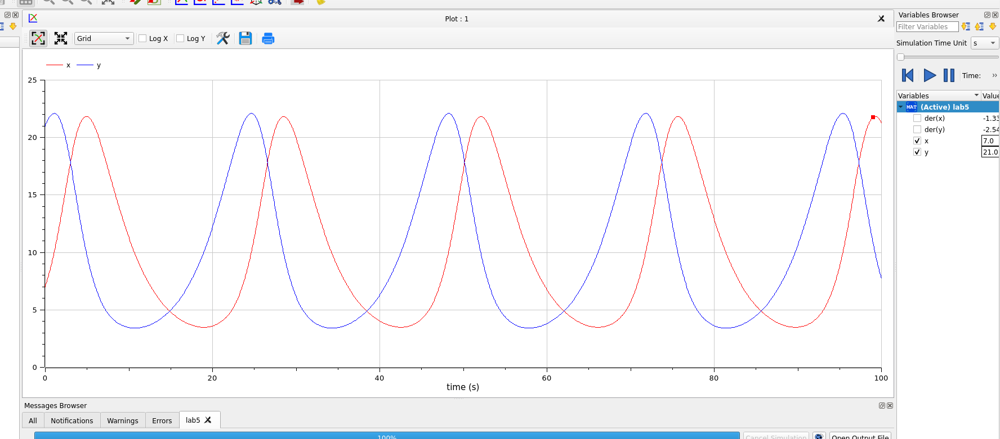

---
## Front matter
title: "Лабораторная работа 5"
author: "Генералов Даниил 1032212280"

## Generic otions
lang: ru-RU
toc-title: "Содержание"

## Bibliography
bibliography: bib/cite.bib
csl: pandoc/csl/gost-r-7-0-5-2008-numeric.csl

## Pdf output format
toc: true # Table of contents
toc-depth: 2
lof: true # List of figures
lot: true # List of tables
fontsize: 12pt
linestretch: 1.5
papersize: a4
documentclass: scrreprt
## I18n polyglossia
polyglossia-lang:
  name: russian
  options:
	- spelling=modern
	- babelshorthands=true
polyglossia-otherlangs:
  name: english
## I18n babel
babel-lang: russian
babel-otherlangs: english
## Fonts
mainfont: PT Serif
romanfont: PT Serif
sansfont: PT Sans
monofont: PT Mono
mainfontoptions: Ligatures=TeX
romanfontoptions: Ligatures=TeX
sansfontoptions: Ligatures=TeX,Scale=MatchLowercase
monofontoptions: Scale=MatchLowercase,Scale=0.9
## Biblatex
biblatex: true
biblio-style: "gost-numeric"
biblatexoptions:
  - parentracker=true
  - backend=biber
  - hyperref=auto
  - language=auto
  - autolang=other*
  - citestyle=gost-numeric
## Pandoc-crossref LaTeX customization
figureTitle: "Рис."
tableTitle: "Таблица"
listingTitle: "Листинг"
lofTitle: "Список иллюстраций"
lotTitle: "Список таблиц"
lolTitle: "Листинги"
## Misc options
indent: true
header-includes:
  - \usepackage{indentfirst}
  - \usepackage{float} # keep figures where there are in the text
  - \floatplacement{figure}{H} # keep figures where there are in the text
---

# Цель работы

В этой работе требуется использовать модель Лотки-Вольтерры
для симуляции населения хищников и жертв.

# Задание

Мой номер студенческого билета 1032212280, и всего вариантов 70, поэтому у меня вариант 51:

> Для модели «хищник-жертва»:
> 
> dx/dt = -0.28x(t)+0.028x(t)y(t); 
> dy/dt = 0.29y(t)-0.029x(t)y(t)
>
>
>Постройте график зависимости численности хищников от численности жертв,
> а также графики изменения численности хищников и численности жертв при
> следующих начальных условиях: x0=7, y0=21. Найдите стационарное
состояние системы.

# Выполнение лабораторной работы

Сначала мы делаем это задание на Julia.
Точно так же, как и в предыдущих задачах,
мы задаем пределы интеграции,
функцию для нахождения производных,
затем решаем уравнение (рис. @fig:001).

{#fig:001 width=70%}

После этого мы рисуем график эволюции системы в обычном и параметрическом виде (рис. @fig:002).

{#fig:002 width=70%}

Мы смогли реализовать этот код на Julia благодаря официальной документации: [@julialang]

После этого мы переводим этот код в OpenModelica, чтобы сравнить ответы (рис. @fig:003).

{#fig:003 width=70%}

Ответ в виде графика выглядит одинаково с вариантом Julia (рис. @fig:004):

{#fig:004 width=70%}

Фазовый рисунок также похожий (рис. @fig:005)

{#fig:005 width=70%}

Для нахождения стационарной точки мы сначала решаем ее вручную, а затем проверяем, задавая ее как начальное условие.
Формула подсказывает нам, что стационарное состояние достигается, когда x0 = 0.29 / 0.029 и y0=0.28/0.028;
то есть когда они оба равны 10.
И действительно, когда мы задаем это значение в OpenModelica, то оба графика выглядят как прямые горизонтальные линии
(рис. @fig:006),
что подтверждает стационарность этой точки.

{#fig:006 width=70%}

Мы смогли реализовать этот код на OpenModelica благодаря документации: [@modelica]

# Выводы

Мы смогли получить одинаковые ответы на задачу в OpenModelica и Julia.

# Список литературы{.unnumbered}

::: {#refs}
:::
