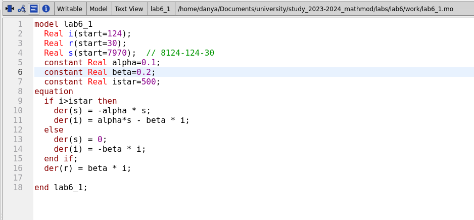
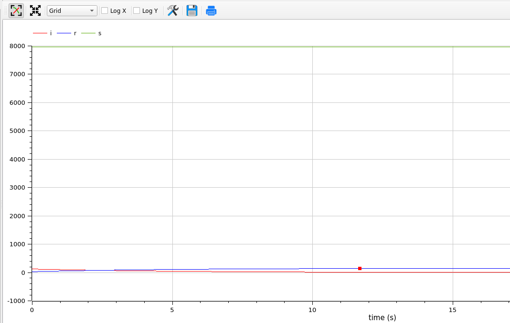
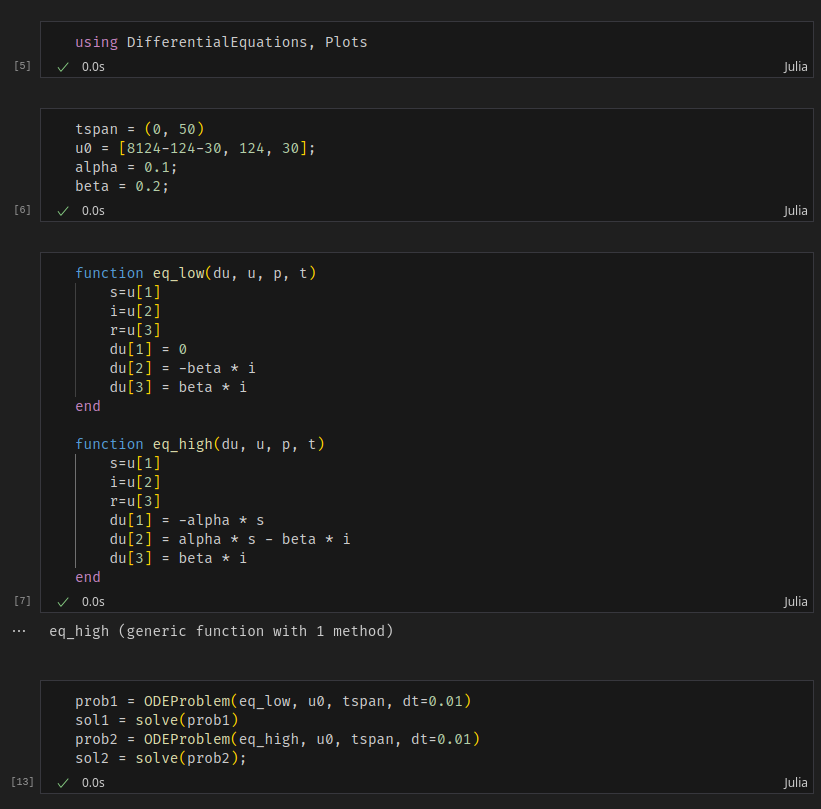
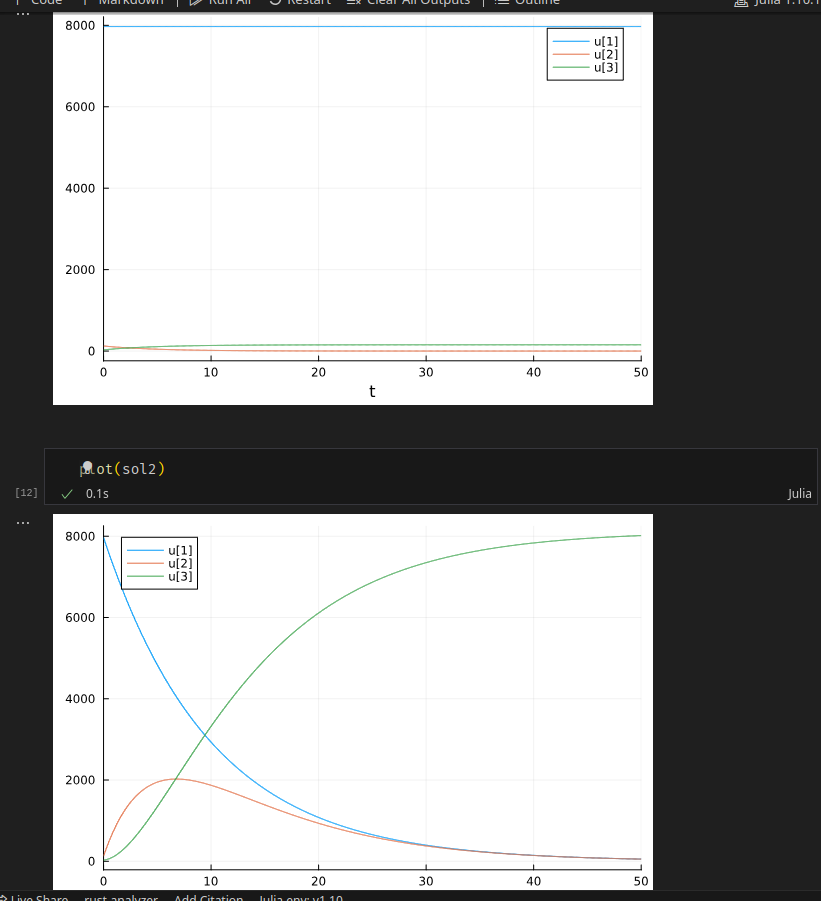

---
## Front matter
lang: ru-RU
title: Лабораторная работа 6
author:
  - Генералов Даниил, 1032212280
institute:
  - Российский университет дружбы народов, Москва, Россия
date: 2024

## i18n babel
babel-lang: russian
babel-otherlangs: english

## Formatting pdf
toc: false
toc-title: Содержание
slide_level: 2
aspectratio: 169
section-titles: true
theme: metropolis
header-includes:
 - \metroset{progressbar=frametitle,sectionpage=progressbar,numbering=fraction}
 - '\makeatletter'
 - '\beamer@ignorenonframefalse'
 - '\makeatother'
---

## Задача

> На одном острове вспыхнула эпидемия. Известно, что из всех проживающих
> на острове (N=8124) в момент начала эпидемии (t=0) число заболевших людей
> (являющихся распространителями инфекции) I(0)=124, А число здоровых людей с
> иммунитетом к болезни R(0)=30. Таким образом, число людей восприимчивых к
> болезни, но пока здоровых, в начальный момент времени S(0)=N-I(0)- R(0).
> Постройте графики изменения числа особей в каждой из трех групп.
> Рассмотрите, как будет протекать эпидемия в случае:
> 1) если I(0) <= I*
> 2) если I(0) > I*

## Выполнение: OpenModelica

{#fig:001 width=70%}

## Выполнение: OpenModelica

{#fig:001 width=70%}

## Выполнение: OpenModelica

{#fig:003 width=70%}

## Выполнение: OpenModelica

{#fig:001 width=70%}

## Выполнение: Julia

{#fig:005 width=70%}

## Выполнение: Julia

{#fig:006 width=70%}

## Выводы

Мы смогли получить одинаковые ответы на задачу в OpenModelica и Julia.
