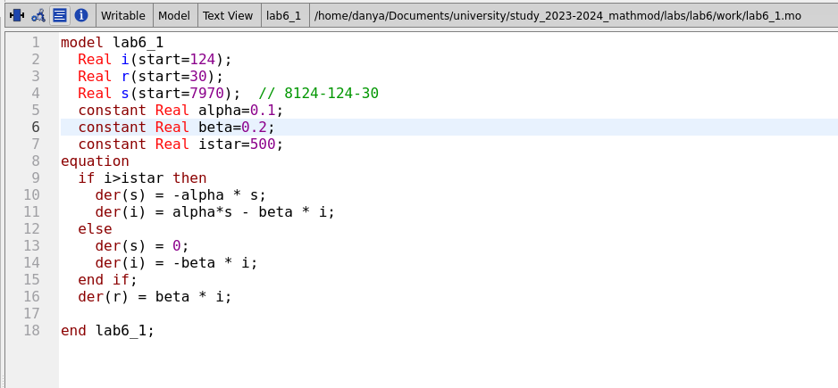
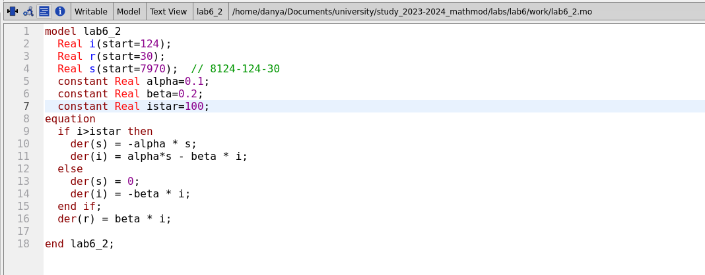
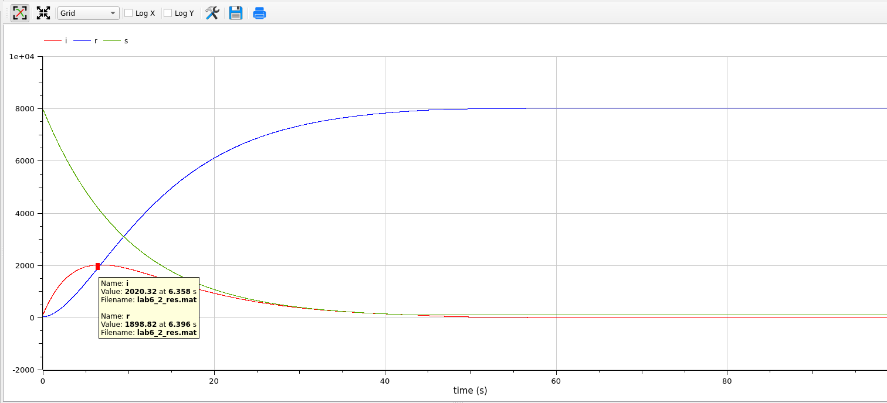
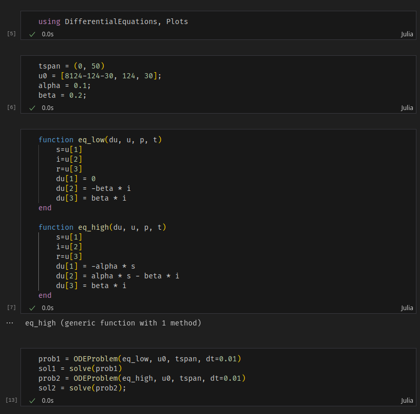
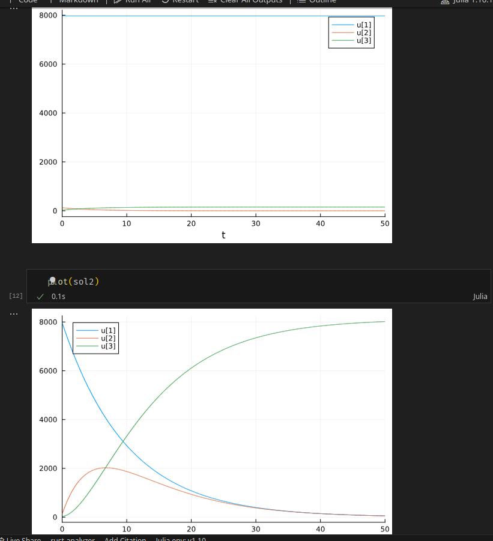

---
## Front matter
title: "Лабораторная работа 6"
author: "Генералов Даниил, 1032212280"

## Generic otions
lang: ru-RU
toc-title: "Содержание"

## Bibliography
bibliography: bib/cite.bib
csl: pandoc/csl/gost-r-7-0-5-2008-numeric.csl

## Pdf output format
toc: true # Table of contents
toc-depth: 2
lof: true # List of figures
lot: true # List of tables
fontsize: 12pt
linestretch: 1.5
papersize: a4
documentclass: scrreprt
## I18n polyglossia
polyglossia-lang:
  name: russian
  options:
	- spelling=modern
	- babelshorthands=true
polyglossia-otherlangs:
  name: english
## I18n babel
babel-lang: russian
babel-otherlangs: english
## Fonts
mainfont: PT Serif
romanfont: PT Serif
sansfont: PT Sans
monofont: PT Mono
mainfontoptions: Ligatures=TeX
romanfontoptions: Ligatures=TeX
sansfontoptions: Ligatures=TeX,Scale=MatchLowercase
monofontoptions: Scale=MatchLowercase,Scale=0.9
## Biblatex
biblatex: true
biblio-style: "gost-numeric"
biblatexoptions:
  - parentracker=true
  - backend=biber
  - hyperref=auto
  - language=auto
  - autolang=other*
  - citestyle=gost-numeric
## Pandoc-crossref LaTeX customization
figureTitle: "Рис."
tableTitle: "Таблица"
listingTitle: "Листинг"
lofTitle: "Список иллюстраций"
lotTitle: "Список таблиц"
lolTitle: "Листинги"
## Misc options
indent: true
header-includes:
  - \usepackage{indentfirst}
  - \usepackage{float} # keep figures where there are in the text
  - \floatplacement{figure}{H} # keep figures where there are in the text
---

# Цель работы

В этой работе мы рассматриваем SIR-модель эпидемии заболевания.

# Задание

Мой номер студенческого билета 1032212280, и всего вариантов 70, поэтому у меня вариант 51:

> На одном острове вспыхнула эпидемия. Известно, что из всех проживающих
> на острове (N=8124) в момент начала эпидемии (t=0) число заболевших людей
> (являющихся распространителями инфекции) I(0)=124, А число здоровых людей с
> иммунитетом к болезни R(0)=30. Таким образом, число людей восприимчивых к
> болезни, но пока здоровых, в начальный момент времени S(0)=N-I(0)- R(0).
> Постройте графики изменения числа особей в каждой из трех групп.
> Рассмотрите, как будет протекать эпидемия в случае:
> 1) если I(0) <= I*
> 2) если I(0) > I*

# Выполнение лабораторной работы

Мы начинаем работу с OpenModelica. Мы задаем модель, которая описывает связь между компонентами S, I и R.
Как коэффициенты альфа и бета мы принимаем значения 0.1 и 0.2, потому что они приводят к хорошему распределению по времени.
Сначала мы берем случай, когда I* больше чем I: в данном случае I* мы приняли равным 500, что выше I=124 (рис. @fig:001).

{#fig:001 width=70%}

Из-за того, что количество S не изменяется, а I естественным образом преобразуются в R, график выглядит не слишком интересно: 
он показывает стабильное убывание I,
и поскольку их количество такое малое по сравнению с S,
это даже не заметно на графике (рис. @fig:002).

{#fig:002 width=70%}

Во второй модели мы меняем это значение I*: теперь оно равняется 100, что ниже 124 (рис. @fig:003).

{#fig:003 width=70%}

Этот график гораздо более интересный, потому что он показывает классическую картину для SIR-моделей:
всплеск заболеваний, который затем гасится отсутствием новых подверженных.
Здесь, пик приходится на примерно 2000 I, и в это время количество R также примерно около 2000 (рис. @fig:004).

{#fig:004 width=70%}

Мы смогли реализовать этот код на OpenModelica благодаря документации: [@modelica]

После этого мы реализуем эту же задачу на Julia. 
Как и с остальными задачами на дифференциальные уравнения, мы задаем начальные условия и функцию, которая вычисляет производные,
и решаем ее (рис. @fig:005).

{#fig:005 width=70%}

Как и в предыдущем случае, мы получаем графики одного варианта, когда эпидемия не запускается успешно, а в другом варианте она достигает пика в 2000 I одновременно (рис. @fig:006).

{#fig:006 width=70%}

Мы смогли реализовать этот код на Julia благодаря официальной документации: [@julialang]

# Выводы

Мы смогли получить одинаковые ответы на задачу в OpenModelica и Julia.

# Список литературы{.unnumbered}

::: {#refs}
:::
