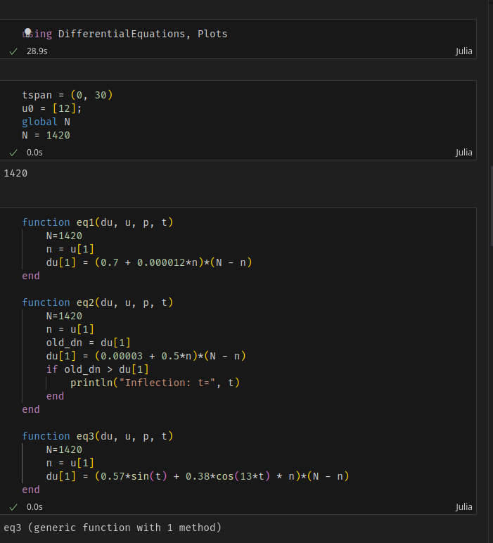
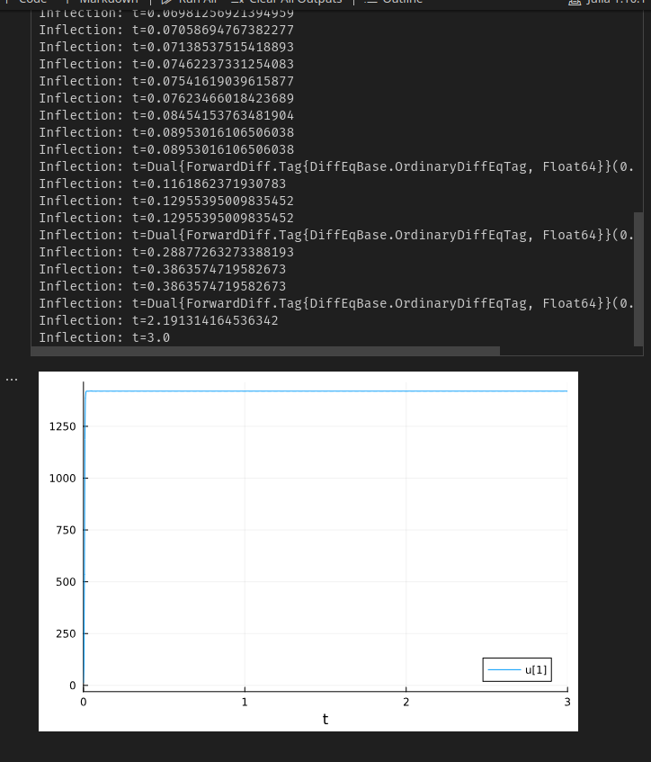
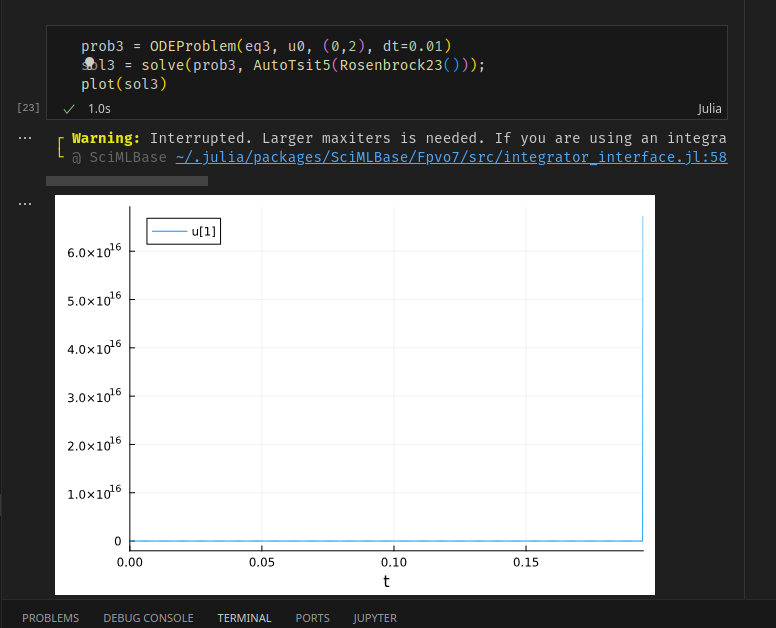
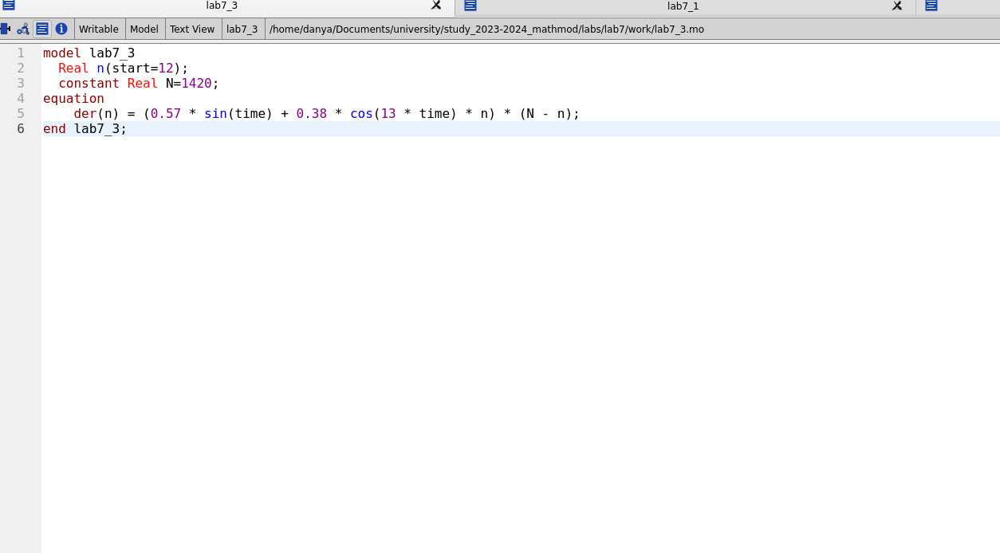
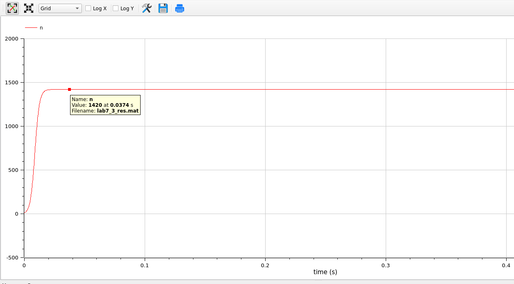

---
## Front matter
lang: ru-RU
title: Лабораторная работа 7
author:
  - Генералов Даниил, 1032212280
institute:
  - Российский университет дружбы народов, Москва, Россия
date: 2024

## i18n babel
babel-lang: russian
babel-otherlangs: english

## Formatting pdf
toc: false
toc-title: Содержание
slide_level: 2
aspectratio: 169
section-titles: true
theme: metropolis
header-includes:
 - \metroset{progressbar=frametitle,sectionpage=progressbar,numbering=fraction}
 - '\makeatletter'
 - '\beamer@ignorenonframefalse'
 - '\makeatother'
---

## Задача

> Постройте график распространения рекламы, математическая модель которой описывается следующим уравнением:
> 
> 1. dn/dt = (0.7 + 0.000012n(t))(N-n(t))
> 2. dn/dt = (0.00003 + 0.5n(t))(N-n(t))
> 3. dn/dt = (0.57sin(t) + 0.38cos(13t)n(t))(N-n(t))
> 
> При этом объем аудитории N=1420, в начальный момент о товаре знает 12 человек. Для случая 2 определите в какой момент времени скорость распространения рекламы будет иметь максимальное значение.

## Выполнение: Julia

{#fig:001 width=70%}

## Выполнение: Julia

{#fig:002 width=70%}

## Выполнение: Julia

{#fig:003 width=70%}

## Выполнение: Julia

{#fig:0035 width=70%}

## Выполнение: OpenModelica
{#fig:004 width=70%}

## Выполнение: OpenModelica

{#fig:005 width=70%}

## Выполнение: OpenModelica

{#fig:006 width=70%}

## Выполнение: OpenModelica

{#fig:007 width=70%}

## Выполнение: OpenModelica

{#fig:0075 width=70%}

## Выполнение: OpenModelica

{#fig:008 width=70%}

## Выводы

Мы смогли получить ответы на задачу в OpenModelica и Julia,
и определить источник проблемы в решении на Julia.
