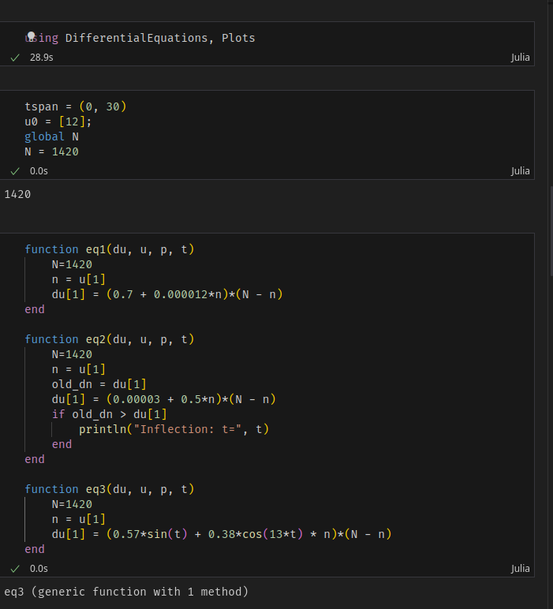
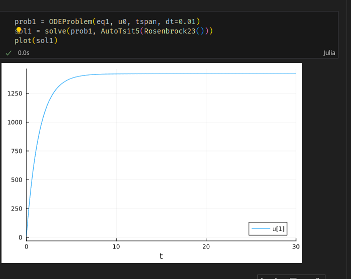
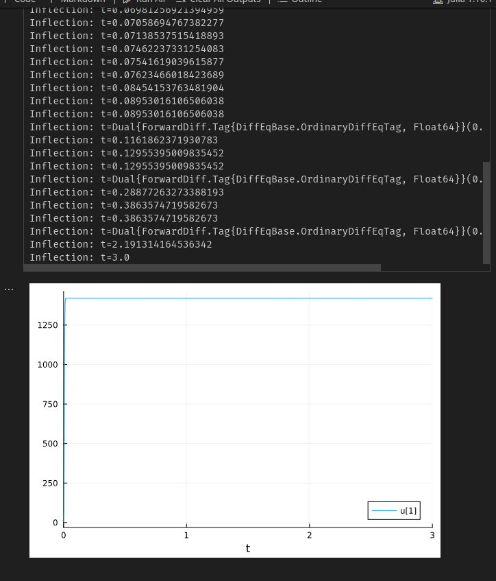
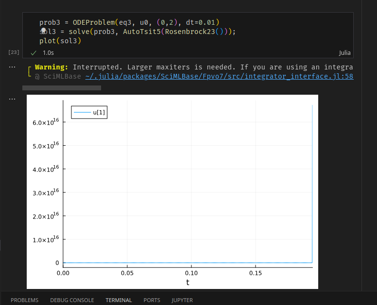
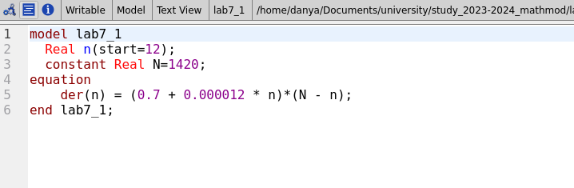
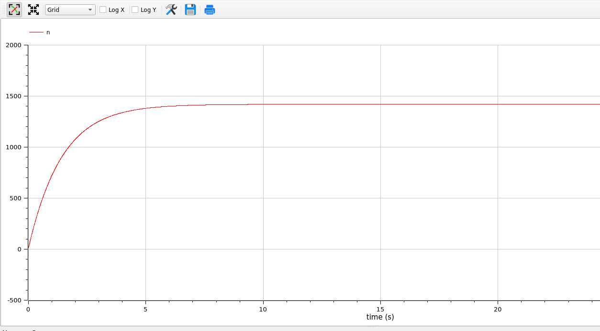
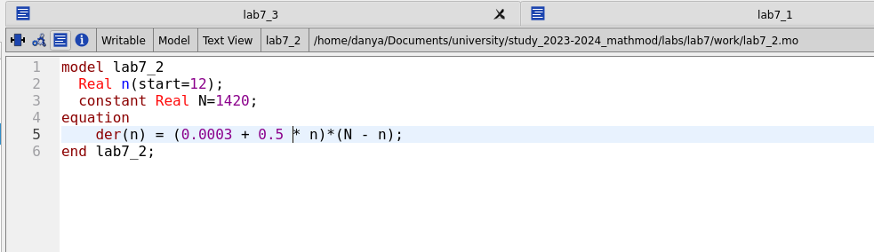
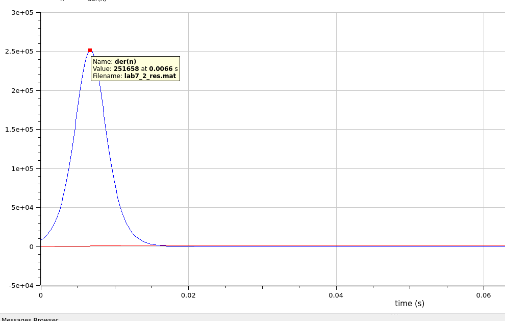
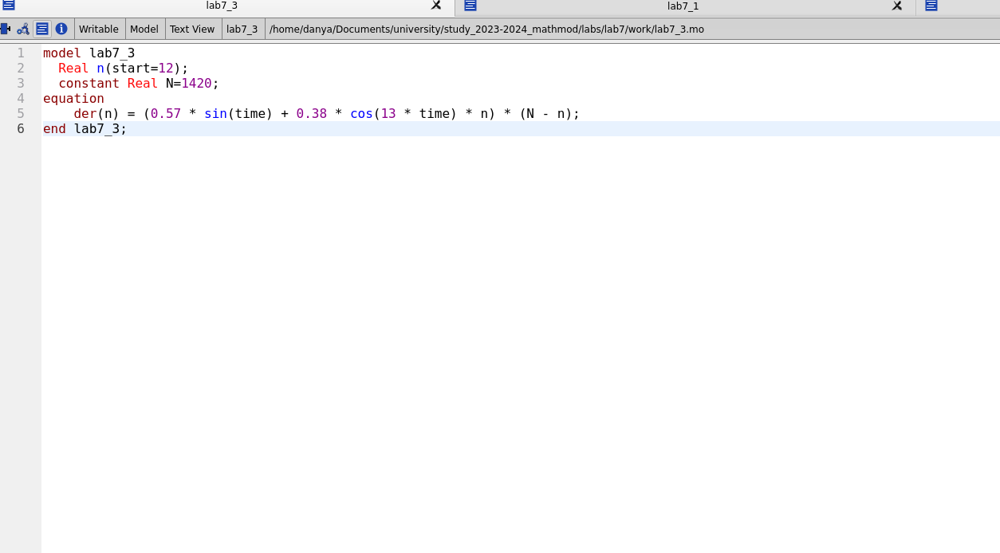
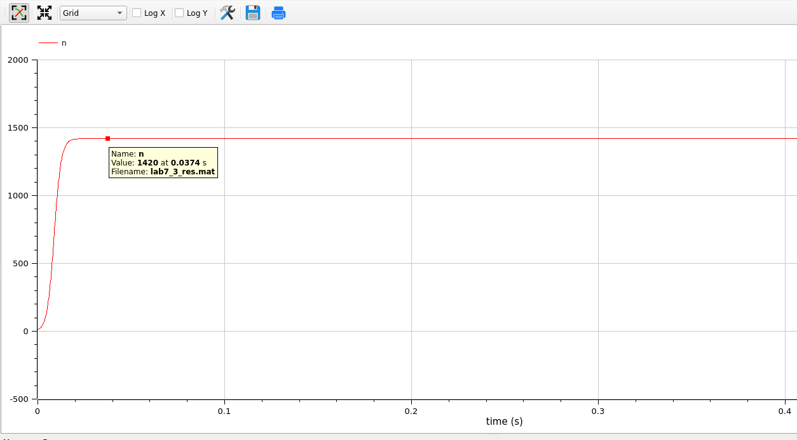

---
## Front matter
title: "Лабораторная работа 7"
author: "Генералов Даниил, 1032212280"

## Generic otions
lang: ru-RU
toc-title: "Содержание"

## Bibliography
bibliography: bib/cite.bib
csl: pandoc/csl/gost-r-7-0-5-2008-numeric.csl

## Pdf output format
toc: true # Table of contents
toc-depth: 2
lof: true # List of figures
lot: true # List of tables
fontsize: 12pt
linestretch: 1.5
papersize: a4
documentclass: scrreprt
## I18n polyglossia
polyglossia-lang:
  name: russian
  options:
	- spelling=modern
	- babelshorthands=true
polyglossia-otherlangs:
  name: english
## I18n babel
babel-lang: russian
babel-otherlangs: english
## Fonts
mainfont: PT Serif
romanfont: PT Serif
sansfont: PT Sans
monofont: PT Mono
mainfontoptions: Ligatures=TeX
romanfontoptions: Ligatures=TeX
sansfontoptions: Ligatures=TeX,Scale=MatchLowercase
monofontoptions: Scale=MatchLowercase,Scale=0.9
## Biblatex
biblatex: true
biblio-style: "gost-numeric"
biblatexoptions:
  - parentracker=true
  - backend=biber
  - hyperref=auto
  - language=auto
  - autolang=other*
  - citestyle=gost-numeric
## Pandoc-crossref LaTeX customization
figureTitle: "Рис."
tableTitle: "Таблица"
listingTitle: "Листинг"
lofTitle: "Список иллюстраций"
lotTitle: "Список таблиц"
lolTitle: "Листинги"
## Misc options
indent: true
header-includes:
  - \usepackage{indentfirst}
  - \usepackage{float} # keep figures where there are in the text
  - \floatplacement{figure}{H} # keep figures where there are in the text
---

# Цель работы

В этой работе мы рассматриваем модель эффективности рекламы.

# Задание

Мой номер студенческого билета 1032212280, и всего вариантов 70, поэтому у меня вариант 51:

> Постройте график распространения рекламы, математическая модель которой описывается следующим уравнением:
> 
> 1. dn/dt = (0.7 + 0.000012n(t))(N-n(t))
> 2. dn/dt = (0.00003 + 0.5n(t))(N-n(t))
> 3. dn/dt = (0.57sin(t) + 0.38cos(13t)n(t))(N-n(t))
> 
> При этом объем аудитории N=1420, в начальный момент о товаре знает 12 человек. Для случая 2 определите в какой момент времени скорость распространения рекламы будет иметь максимальное значение.

# Выполнение лабораторной работы

Сначала мы решаем эту задачу на Julia.

Первым делом мы задаем формулы для уравнений как функции, модифицирующие свои аргументы, как обычно.
Для функции второго уравнения мы добавляем особенность:
если старая производная была меньше больше текущей, значит мы начали убывать в значении, и поэтому пишем на экран текущее время для поиска пикового момента времени (рис. @fig:001).

{#fig:001 width=70%}

Первый результат выглядит вполне разумно: по логистической кривой значение достигает своего максимума и остается там (рис. @fig:002).

{#fig:002 width=70%}

Однако второй результат не правдоподобен: он достигает своего максимума моментально, а затем колебается вокруг него, из-за чего вывод заполнен случайными числами из диапазона измерения (рис. @fig:003).

{#fig:003 width=70%}

Третья задача также проблематична: сначала все значения близки к нулю, а затем внезапно достигают 6*10^16, после чего решатель останавливается
(рис. @fig:0035).

{#fig:0035 width=70%}

Эти ответы нереалистичны, но возможно это проблема с уравнениями. Это можно будет узнать в следующей части.

Мы смогли реализовать этот код на Julia благодаря официальной документации: [@julialang]

Решая задачу на OpenModelica, мы сможем определить, проблема с уравнениями ли или с решателем.

Первая задача пишется довольно просто: только одна переменная и ее дифференциальное уравнение (рис. @fig:004).

{#fig:004 width=70%}

И ее решение также выглядит весьма простым, и, что важно, совпадающим с решением от Julia (рис. @fig:005).
{#fig:005 width=70%}

Код задачи 2 настолько же простой (рис. @fig:006).

{#fig:006 width=70%}

Решение действительно показывает, что значение достигает своего максимума почти моментально: за 0.007 секунд достигается пик производной, и за такое же время производная доходит до близкого к нулю значения (рис. @fig:007).

{#fig:007 width=70%}

Код третьей задачи также состоит только из одного уравнения (рис. @fig:0075).

{#fig:0075 width=70%}

Ее решение также очень быстро поднимается до максимума.
Это показывает, что проблема в коде Julia была в слишком большом шаге времени:
эти уравнения работают на микросекундном уровне,
и шаги времени в 0.01 секунд недопустимы для этой задачи
(рис. @fig:008)

{#fig:008 width=70%}

Мы смогли реализовать этот код на OpenModelica благодаря документации: [@modelica]

# Выводы

Мы смогли получить ответы на задачу в OpenModelica и Julia,
и определить источник проблемы в решении на Julia.

# Список литературы{.unnumbered}

::: {#refs}
:::
