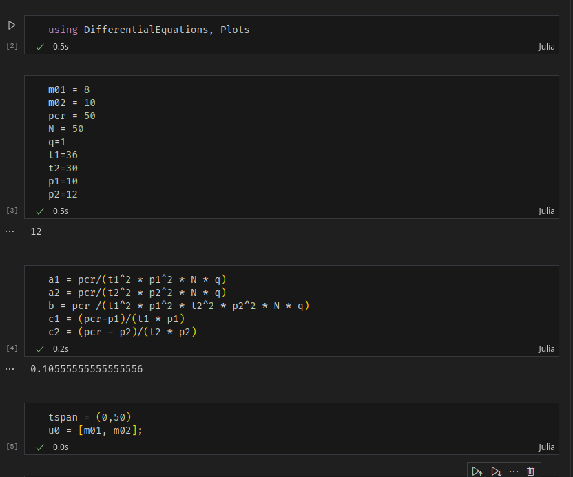
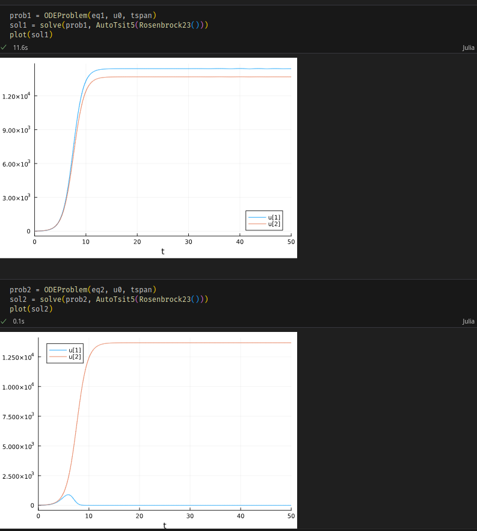
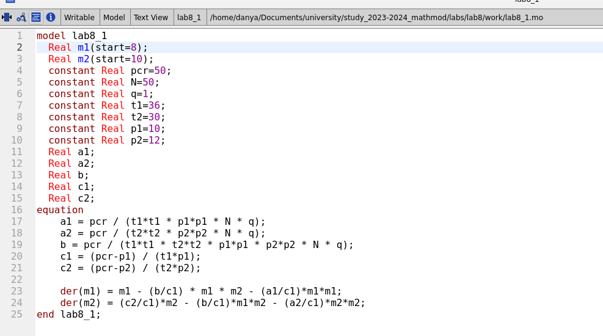
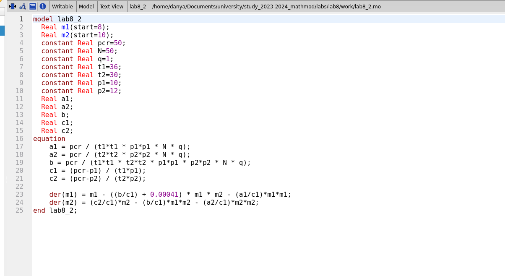
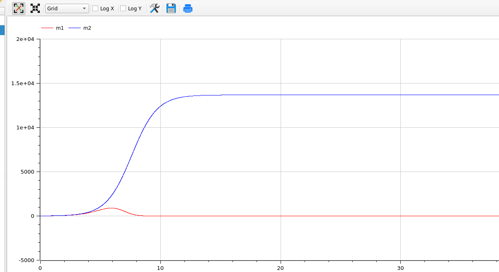

---
## Front matter
lang: ru-RU
title: Лабораторная работа 8
author:
  - Генералов Даниил, 1032212280
institute:
  - Российский университет дружбы народов, Москва, Россия
date: 2024

## i18n babel
babel-lang: russian
babel-otherlangs: english

## Formatting pdf
toc: false
toc-title: Содержание
slide_level: 2
aspectratio: 169
section-titles: true
theme: metropolis
header-includes:
 - \metroset{progressbar=frametitle,sectionpage=progressbar,numbering=fraction}
 - '\makeatletter'
 - '\beamer@ignorenonframefalse'
 - '\makeatother'
---

## Задача

> Случай 1. Рассмотрим две фирмы, производящие взаимозаменяемые товары
> одинакового качества и находящиеся в одной рыночной нише. Считаем, что в рамках
> нашей модели конкурентная борьба ведётся только рыночными методами. То есть,
> конкуренты могут влиять на противника путем изменения параметров своего
> производства: себестоимость, время цикла, но не могут прямо вмешиваться в
> ситуацию на рынке («назначать» цену или влиять на потребителей каким-либо иным
> способом.) Будем считать, что постоянные издержки пренебрежимо малы, и в
> модели учитывать не будем. В этом случае динамика изменения объемов продаж
> фирмы 1 и фирмы 2 описывается следующей системой уравнений:

> $$\frac{dM_1}{d\theta} = M_1 - \frac{b}{c_1}M_1 M_2 - \frac{a_1}{c_1}M_1^2$$
> $$\frac{dM_1}{d\theta} = \frac{c_2}{c_1}M_2 - \frac{b}{c_1}M_1 M_2 - \frac{a_2}{c_1}M_1^2$$

> где $a_1 = \frac{p_{cr}}{t_1^2 p_1^2 Nq}$, $a_2 = \frac{p_{cr}}{t_2^2 p_2^2 Nq}$, 
> $b = \frac{p_{cr}}{t_1^2 p_1^2 t_2^2 p_2^2 Nq}$, $c_1 = \frac{p_{cr} - p_1}{t_1 p_1}$, $c_2 = \frac{p_{cr}}{t_2 p_2}$. Также введена нормировка $T=c_1\theta$.

## Задача

> Случай 2. Рассмотрим модель, когда, помимо экономического фактора
> влияния (изменение себестоимости, производственного цикла, использование
> кредита и т.п.), используются еще и социально-психологические факторы –
> формирование общественного предпочтения одного товара другому, не зависимо от
> их качества и цены. В этом случае взаимодействие двух фирм будет зависеть друг
> от друга, соответственно коэффициент перед $M_1 M_2$ будет отличаться. Пусть в
> рамках рассматриваемой модели динамика изменения объемов продаж фирмы 1 и
> фирмы 2 описывается следующей системой уравнений:

> $$\frac{dM_1}{d\theta} = M_1 - (\frac{b}{c_1} + 0.00041)M_1M_2 - \frac{a_1}{c_1} M_1^2$$
> $$\frac{dM_2}{d\theta} = \frac{c_2}{c_1}M_2 - \frac{b}{c_1}M_1M_2 - \frac{a_2}{c_1}M_2^2$$

> Для обоих случаев рассмотрим задачу со следующими начальными условиями и параметрами:
> $ M_0^1 = 8$, $M_0^2 = 10$, $p_{cr} = 50$, $N=50$, $q=1$, $t_1=36$, $t_2=30$, $p_1=10$, $p_2 = 12$.
> Замечание: Значения $p_{cr}, $p_{1,2}$, $N$ указаны в тысячах единиц, а значения $M_{1,2}$ указаны в млн. единиц.

## Выполнение: Julia

{#fig:001 width=70%}

## Выполнение: Julia

{#fig:002 width=70%}

## Выполнение: OpenModelica

{#fig:003 width=70%}

## Выполнение: OpenModelica

{#fig:004 width=70%}

## Выполнение: OpenModelica

{#fig:005 width=70%}

## Выполнение: OpenModelica

{#fig:006 width=70%}

## Выводы

Мы смогли получить одинаковые ответы на задачу в OpenModelica и Julia.
