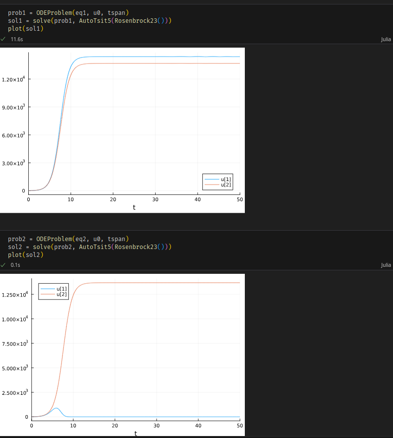
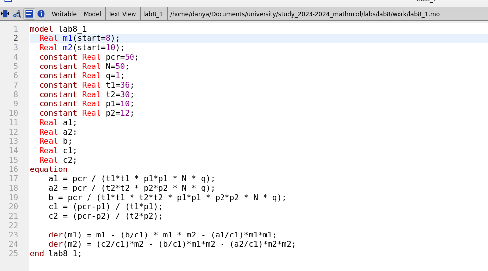
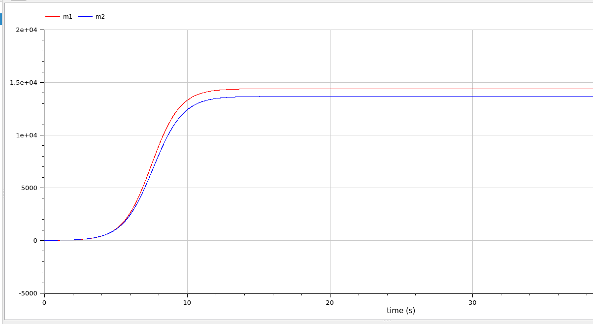

---
## Front matter
title: "Лабораторная работа 8"
author: "Генералов Даниил, 1032212280"

## Generic otions
lang: ru-RU
toc-title: "Содержание"

## Bibliography
bibliography: bib/cite.bib
csl: pandoc/csl/gost-r-7-0-5-2008-numeric.csl

## Pdf output format
toc: true # Table of contents
toc-depth: 2
lof: true # List of figures
lot: true # List of tables
fontsize: 12pt
linestretch: 1.5
papersize: a4
documentclass: scrreprt
## I18n polyglossia
polyglossia-lang:
  name: russian
  options:
	- spelling=modern
	- babelshorthands=true
polyglossia-otherlangs:
  name: english
## I18n babel
babel-lang: russian
babel-otherlangs: english
## Fonts
mainfont: PT Serif
romanfont: PT Serif
sansfont: PT Sans
monofont: PT Mono
mainfontoptions: Ligatures=TeX
romanfontoptions: Ligatures=TeX
sansfontoptions: Ligatures=TeX,Scale=MatchLowercase
monofontoptions: Scale=MatchLowercase,Scale=0.9
## Biblatex
biblatex: true
biblio-style: "gost-numeric"
biblatexoptions:
  - parentracker=true
  - backend=biber
  - hyperref=auto
  - language=auto
  - autolang=other*
  - citestyle=gost-numeric
## Pandoc-crossref LaTeX customization
figureTitle: "Рис."
tableTitle: "Таблица"
listingTitle: "Листинг"
lofTitle: "Список иллюстраций"
lotTitle: "Список таблиц"
lolTitle: "Листинги"
## Misc options
indent: true
header-includes:
  - \usepackage{indentfirst}
  - \usepackage{float} # keep figures where there are in the text
  - \floatplacement{figure}{H} # keep figures where there are in the text
---

# Цель работы

В этой работе мы рассматриваем модель конкуренции фирм.

# Задание

Мой номер студенческого билета 1032212280, и всего вариантов 70, поэтому у меня вариант 51:

> Случай 1. Рассмотрим две фирмы, производящие взаимозаменяемые товары
> одинакового качества и находящиеся в одной рыночной нише. Считаем, что в рамках
> нашей модели конкурентная борьба ведётся только рыночными методами. То есть,
> конкуренты могут влиять на противника путем изменения параметров своего
> производства: себестоимость, время цикла, но не могут прямо вмешиваться в
> ситуацию на рынке («назначать» цену или влиять на потребителей каким-либо иным
> способом.) Будем считать, что постоянные издержки пренебрежимо малы, и в
> модели учитывать не будем. В этом случае динамика изменения объемов продаж
> фирмы 1 и фирмы 2 описывается следующей системой уравнений:

> $$\frac{dM_1}{d\theta} = M_1 - \frac{b}{c_1}M_1 M_2 - \frac{a_1}{c_1}M_1^2$$
> $$\frac{dM_1}{d\theta} = \frac{c_2}{c_1}M_2 - \frac{b}{c_1}M_1 M_2 - \frac{a_2}{c_1}M_1^2$$

> где $a_1 = \frac{p_{cr}}{t_1^2 p_1^2 Nq}$, $a_2 = \frac{p_{cr}}{t_2^2 p_2^2 Nq}$, 
> $b = \frac{p_{cr}}{t_1^2 p_1^2 t_2^2 p_2^2 Nq}$, $c_1 = \frac{p_{cr} - p_1}{t_1 p_1}$, $c_2 = \frac{p_{cr}}{t_2 p_2}$. Также введена нормировка $T=c_1\theta$.

> Случай 2. Рассмотрим модель, когда, помимо экономического фактора
> влияния (изменение себестоимости, производственного цикла, использование
> кредита и т.п.), используются еще и социально-психологические факторы –
> формирование общественного предпочтения одного товара другому, не зависимо от
> их качества и цены. В этом случае взаимодействие двух фирм будет зависеть друг
> от друга, соответственно коэффициент перед $M_1 M_2$ будет отличаться. Пусть в
> рамках рассматриваемой модели динамика изменения объемов продаж фирмы 1 и
> фирмы 2 описывается следующей системой уравнений:

> $$\frac{dM_1}{d\theta} = M_1 - (\frac{b}{c_1} + 0.00041)M_1M_2 - \frac{a_1}{c_1} M_1^2$$
> $$\frac{dM_2}{d\theta} = \frac{c_2}{c_1}M_2 - \frac{b}{c_1}M_1M_2 - \frac{a_2}{c_1}M_2^2$$

> Для обоих случаев рассмотрим задачу со следующими начальными условиями и параметрами:
> $ M_0^1 = 8$, $M_0^2 = 10$, $p_{cr} = 50$, $N=50$, $q=1$, $t_1=36$, $t_2=30$, $p_1=10$, $p_2 = 12$.
> Замечание: Значения $p_{cr}, $p_{1,2}$, $N$ указаны в тысячах единиц, а значения $M_{1,2}$ указаны в млн. единиц.

# Выполнение лабораторной работы

Сначала мы решаем эту задачу на Julia.

Сначала мы задаем используемые в уравнениях константы и производные от них (рис. @fig:001).

{#fig:001 width=70%}

После этого решение дифференциального уравнения выглядит довольно понятным:
в первом случае две фирмы сосуществуют, и их значение остается константным,
хотя значение у фирмы 1 больше чем у фирмы 2;
во втором случае же фирма 1 выходит на нулевое значение (рис. @fig:002).

{#fig:002 width=70%}

Мы смогли реализовать этот код на Julia благодаря официальной документации: [@julialang]

После этого мы пишем аналогичные уравнения в OpenModelica.
Мы описываем константы как `constant Real`, а производные от них являются переменными, которые зависят только от этих констант (рис. @fig:003).

{#fig:003 width=70%}

Результат симуляции похож по форме на первый вариант (рис. @fig:004).

{#fig:004 width=70%}

Задача 2 почти идентична задаче 1, за исключением формулы для M1 (рис. @fig:005).

{#fig:005 width=70%}

И ее решение также выглядит похоже на предыдущий график (рис. @fig:006).

{#fig:006 width=70%}

Мы смогли реализовать этот код на OpenModelica благодаря документации: [@modelica]

# Выводы

Мы смогли получить одинаковые ответы на задачу в OpenModelica и Julia.

# Список литературы{.unnumbered}

::: {#refs}
:::
