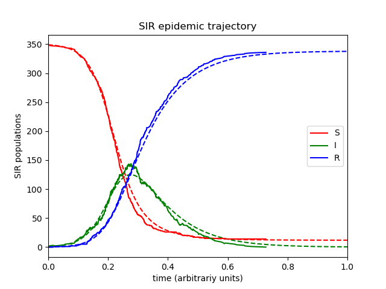

---
## Front matter
lang: ru-RU
title: Модель заражения SIR
author:
  - Генералов Д. М. 1032212280
institute:
  - Российский университет дружбы народов, Москва, Россия
date: 2024

## i18n babel
babel-lang: russian
babel-otherlangs: english

## Formatting pdf
toc: false
toc-title: Содержание
slide_level: 2
aspectratio: 169
section-titles: true
theme: metropolis
header-includes:
  - \metroset{progressbar=frametitle,sectionpage=progressbar,numbering=fraction}
  - '\makeatletter'
  - '\beamer@ignorenonframefalse'
  - '\makeatother'
  - \usepackage{indentfirst}
  - \usepackage{float} # keep figures where there are in the text
  - \floatplacement{figure}{H} # keep figures where there are in the text
---

## Компартментальные модели

## SIR-модель в дифф.ур.

$$
  \begin{cases}
    \frac{dS}{dt} = -\frac{\beta I S}{N} \\
    \frac{dI}{dt} = \frac{\beta I S}{N} - \gamma I \\
    \frac{dR}{dt} = \gamma I
  \end{cases}
$$

где:

- $\beta$ = среднее число контактов за единицу времени * вероятность передачи одним контактом
- $\gamma = \frac{1}{D}$, где $D$ -- время течения заболевания

## SIR-модель по графику

## $R_0$ -- показатель заразности болезни

$$R_0 = \frac{\beta}{\gamma}$$

SARS-CoV-2: $2.9 \rightarrow 4.0 \rightarrow 5.1 \rightarrow 9.5$

## Количество выздоровевших меняет скорость распространения

$$\frac{dS}{dt} = -\frac{\beta I S}{N}$$

## $R$ -- показатель распространения болезни

## SIRS/SEIRS-модели

Иммунитет может быть потерян за время

## Применения модели: пик

## Применения модели: хвост

## Применения модели: финальное количество R

# Спасибо за внимание