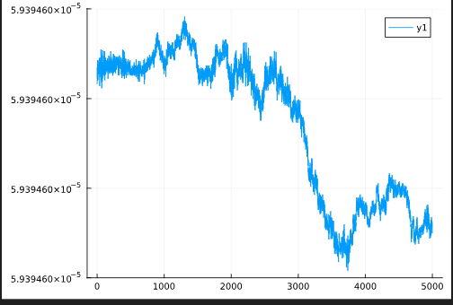

---
## Front matter
lang: ru-RU
title: Моделирование образования планетной системы 
subtitle: Этап 4
author:
  - Матюхин Г. В.
  - Генералов Д. М.
institute:
  - Российский университет дружбы народов, Москва, Россия
date: 23 марта 2024

## i18n babel
babel-lang: russian
babel-otherlangs: english

## Formatting pdf
toc: false
toc-title: Содержание
slide_level: 2
aspectratio: 169
section-titles: true
theme: metropolis
header-includes:
 - \metroset{progressbar=frametitle,sectionpage=progressbar,numbering=fraction}
 - '\makeatletter'
 - '\beamer@ignorenonframefalse'
 - '\makeatother'
---

# Цель работы

Провести моделирование одного из этапов эволюции Вселенной -- образование некой "солнечной" системы из межзвездного газа.

# Выполнение

## Репозиторий

https://github.com/danya02/study_2023-2024_mathmod/tree/master/project-group/stage4

## Симуляция

- Ускоренный движок вычислений -- больше частиц, больше шагов времени.

- Но закончилась оперативная память.

- _download more RAM??_

## Размеры образов симуляции

Все файлы JSON

Количество частиц | Количество шагов | Размер
---|---|---
50,000 | 240 | 24G
5,000 | 600 | 2.1G
1,000 | 600 | 894M

Выбраны основные размеры: 1,000 и 10,000 частиц -- 
хороший баланс между детальностью, скоростью работы и памятью

## Децимация путей частиц

Путь частицы -- набор координат во времени

Blender медленно работает с такими данными

Алгоритм Рамера — Дугласа — Пекера сокращает количество точек при потере точности
(и возможной потере повторяющихся участков пути):
пригоден только для визуализации, вычисления проводятся на исходных данных.

{width=70%}

## Метрики

- Потенциальная и кинетическая энергия
  - Сумма должна оставаться постоянной или возра
- Количество частиц по времени
- Общий импульс системы
  - Должен быть постоянным, любые изменения -- численные ошибки

## Ошибки в импорте/экспорте

{width=70%}

## Катастрофическая потеря точности

{width=70%}

## Катастрофическая потеря точности

{width=70%}

## Вращение системы

Должно быть низким: порядка $10^{-8}$ рад/с.
Иначе все разлетится: линейная скорость в центре высокая.

{width=70%}

## Вращение системы

С уменьшением угловой скорости меньше разлетания,
но большинство частиц все-таки уходят на бесконечность.

{width=70%}

## Вращение системы

Но если вращение недостаточно быстрое, то система схлопывается в небольшое количество центральных масс

{width=70%}

## Финальные параметры

- Шаг времени: $10^5$ секунд за кадр
- 10000 частиц
- масса: от 0 до 6 кг
- плотность: до 1.3 кг/м3
- больше 100000 кадров (отрендерено 12000)

## Финальные метрики: энергия

{width=70%}

## Финальные метрики: импульс

{width=70%}

## Финальные метрики: количество частиц

{width=70%}

## Финальные метрики: энергия

{width=70%}

## Финальные метрики: импульс

{width=70%}

## Визуализация

- Облако частиц большое, размер неизвестен
- Некоторые частицы вылетают в бесконечность
- Используем управляемую визуализацию с бесконечным пространством
- Blender 3D

## Визуализация

... видео ...

## Результаты

- Формирование бинарных систем
- Ограниченный размер основного кластера
- Число частиц следует обратному экспоненциальному закону

## Проблемы

- Постоянный шаг времени приводит к потере точности
  - Поможет изменять шаг в зависимости от близости частиц
- Количество частиц ограничено
  - Не хватает оперативной памяти
  - Нельзя уменьшить использование без потери скорости
  - Можно использовать GPU-вычисления
- Только 2D-симуляция
  - Позволяет только симулировать формирование из диска
  - Но в 3D первый этап -- образование диска

# Выводы

Мы успешно смогли провести симуляцию развития солнечной системы на основании гравитационного взаимодействия и силы тяжести. Наш код может послужить основой для дальнейшего исследования темы. 
music